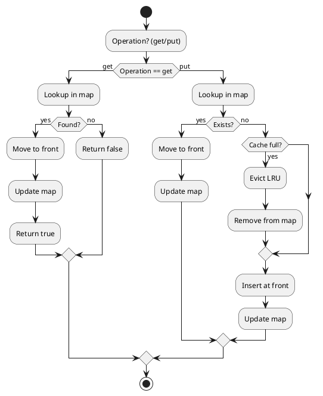

---

# A Basic LRU Cache Design Using Standard STL Data Structures

## Introduction

An LRU (Least Recently Used) cache is a common design pattern used to manage a fixed-size collection of items where the least recently accessed items are removed first. In this article, we explore a simple LRU cache implementation in C++ that leverages only the standard library—specifically, `std::list` and `std::unordered_map`. The design aims for optimal O(1) time complexity for both insertion (put) and access (get) operations.

## Data Structures

To achieve constant-time operations, we use the following:

- **`std::list`**:  
  - Implements a doubly-linked list that allows constant-time insertions and deletions anywhere in the list.
  - Its iterators remain valid even after calling `splice()`, which relinks nodes without invalidating the iterator.

- **`std::unordered_map`**:  
  - Provides O(1) average time complexity for lookups.
  - Maps a unique key (in our case, an order's ID) to an iterator pointing into the `std::list`.

### Why Not Alternatives?

- **`std::deque` / `std::vector`**:  
  - These containers have faster random-access but incur a cost when inserting or deleting elements from the middle.
- **`std::map`**:  
  - Offers O(log N) lookups which is less efficient compared to the O(1) average time of an unordered_map.
## Logic

<!--

-->


## Interface Overview

The cache is implemented as a class with the following key methods:

- **`put(const order&)`**:  
  Inserts an order into the cache. If the order exists, it is moved to the front (most recently used). If the cache is full, the least recently used order (the one at the back of the list) is evicted.

- **`get(size_t orderID)`**:  
  Retrieves an order by its unique ID. If found, the order is moved to the front and a pointer to it is returned; otherwise, `nullptr` is returned.

- **`moveToFront(iterator)`**:  
  A helper method that uses `std::list::splice()` to move an element to the front of the list. Because splice only relinks the node, the iterator remains valid and the cache mapping stays correct.

## Detailed Method Explanations

### The `moveToFront` Method

```cpp
/**
 * Moves an order to the front of the list.
 * - `std::list::splice` relinks the node to the front
 *   without invalidating its iterator.
 * - Since the iterator remains valid after splice,
 *   the mapping in the cache remains correct.
 */
void moveToFront(std::list<order>::iterator orderIter) {
  orders.splice(orders.begin(), orders, orderIter);
}
```

**Key Points:**

- **Splice Operation:**  
  The `splice()` function changes the internal links of the list nodes to reposition the specified element. It does not alter the memory address of the element; hence, any iterator referring to that element remains valid.
  
- **Cache Mapping:**  
  Since the iterator remains valid after splicing, the pointer stored in the `cache` continues to reference the correct element. Therefore, there is no need to update the mapping after a splice.

### The `put` Method

```cpp
void put(const order& ord) {
  auto iter = cache.find(ord.id);
  if (iter != cache.end()) {
    // Order exists: move it to the front.
    auto& [orderID, orderIter] = *iter;
    moveToFront(orderIter);
  } else {
    // If at capacity, remove the least recently used order.
    if (cache.size() == capacity) {
      auto lruOrder = orders.back();
      orders.pop_back();
      cache.erase(lruOrder.id);
    }
    // Insert the new order at the front.
    orders.push_front(ord);
    cache[ord.id] = orders.begin();
  }
}
```

**Key Points:**

- **Updating Existing Orders:**  
  If the order already exists in the cache (found via `cache.find(ord.id)`), it is moved to the front using `moveToFront`. Structured bindings (introduced in C++17) are used to unpack the cache entry for clarity.
  
- **Eviction Policy:**  
  If the cache is at capacity, the order at the back of the list (the least recently used) is removed from both the `orders` list and the `cache` map.
  
- **Insertion:**  
  New orders are inserted at the front, and their corresponding iterators are stored in the cache for quick future lookup.

### The `get` Method

```cpp
const order* get(size_t orderID) {
  auto iter = cache.find(orderID);
  if (iter == cache.end())
    return nullptr;
  else {
    auto& [orderID, orderIter] = *iter;
    moveToFront(orderIter);
    return &*orderIter;
  }
}
```

**Key Points:**

- **Lookup:**  
  The method first looks up the order in the cache using its ID.
  
- **Promotion on Access:**  
  If the order is found, it is moved to the front of the list to mark it as recently used.
  
- **Return Value:**  
  A pointer to the order is returned. Note that using structured bindings to access `orderIter` is equivalent to using `iter->second`. The style choice is up to readability preferences.

## Final Code

Below is the complete code discussed in this article:

```cpp
#include <list>
#include <unordered_map>

struct order {
  size_t id;
  double price;
  int quantity;
};

class lru {
 private:
  std::list<order> orders;
  std::unordered_map<size_t, std::list<order>::iterator> cache;
  size_t capacity = 5;

  /**
   * Moves an order to the front of the list.
   * - `std::list::splice` relinks the node to the front
   *   without invalidating its iterator.
   * - Since the iterator remains valid after splice,
   *   the mapping in the cache remains correct.
   */
  void moveToFront(std::list<order>::iterator orderIter) {
    orders.splice(orders.begin(), orders, orderIter);
  }

 public:
  lru() = default;
  lru(size_t maxSize): capacity(maxSize)
  { }

  void put(const order& ord) {
    auto iter = cache.find(ord.id);
    if (iter != cache.end()) {
      auto& [orderID, orderIter] = *iter;
      moveToFront(orderIter);
    } else {
      if (cache.size() == capacity) {
        auto lruOrder = orders.back();
        orders.pop_back();
        cache.erase(lruOrder.id);
      }
      orders.push_front(ord);
      cache[ord.id] = orders.begin();
    }
  }

  const order* get(size_t orderID) {
    auto iter = cache.find(orderID);
    if (iter == cache.end())
      return nullptr;
    else {
      auto& [orderID, orderIter] = *iter;
      moveToFront(orderIter);
      return &*orderIter;
    }
  }
};
```

## Conclusion

This article presented a preliminary LRU cache design using only the standard C++ library and STL data structures. The design:
- Uses `std::list` for maintaining order (allowing O(1) insertions, deletions, and splicing).
- Employs `std::unordered_map` for O(1) lookups.
- Demonstrates a simple interface with `put` and `get` methods.
- Explains why alternatives (like `std::deque` or `std::map`) were not chosen due to performance considerations.

Keep in mind that this design is meant for intoduction purposes—it omits advanced topics like concurrency, robust error handling, and other real-world optimizations. It serves as a foundation for understanding optimal LRU cache design using standard library components.

