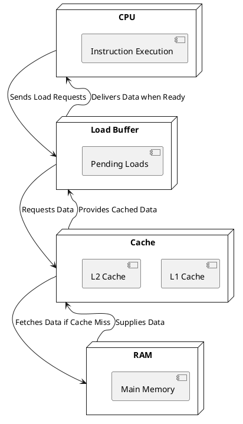

**# Understanding Load Buffers and Parallel Execution in CPUs**

## **Introduction**
Modern CPUs achieve high performance through **out-of-order execution** and **memory-level parallelism**. One critical component enabling this is the **load buffer**, which allows the CPU to continue executing instructions while waiting for data to be loaded from memory. In this article, we explore the behavior of load buffers with **step-by-step execution walkthroughs**, **assembly analysis**, and a **C++ example** to visualize their effect.

---

## **Scenario 1: Single Load with Dependent and Independent Instructions**

### **C++ Code Example**
```cpp
#include <iostream>

volatile int global_var = 42;  // Prevent compiler optimization

int main() {
    int a, b, c;

    // Load operation
    a = global_var;  // Load from memory

    // Dependent instructions (must wait for 'a' to be ready)
    b = a * 2;
    c = b + 10;

    // Independent instruction (can execute in parallel)
    int d = 100;  
    d += 50;  

    // Prevent optimization
    std::cout << a << " " << b << " " << c << " " << d << "\n";

    return 0;
}
```

### **Explanation**
- The CPU fetches `global_var` into the **load buffer**.
- `b = a * 2` and `c = b + 10` **must wait** for the load to complete (dependent instructions).
- Meanwhile, `d = 100` and `d += 50` **can execute independently** and in parallel.

### **Expected Compiler Explorer Output (x86 Assembly)**
```assembly
mov     eax, DWORD PTR global_var[rip]   ; Load 'a' from memory
imul    eax, eax, 2                      ; 'b = a * 2' (depends on 'a')
add     eax, 10                           ; 'c = b + 10' (depends on 'b')
mov     DWORD PTR [rbp-4], eax            ; Store 'c'

mov     ecx, 100                          ; Independent instruction 'd = 100'
add     ecx, 50                           ; 'd += 50'
```

### **CPU Execution Walkthrough**
1. The CPU **loads** `global_var` into the **load buffer**.
2. **Dependent Instructions (`b = a * 2`, `c = b + 10`)** **must wait** until the data is fetched.
3. **Independent Instructions (`d = 100`, `d += 50`) execute in parallel** while waiting.
4. Once the load completes, the dependent instructions execute in sequence.

### **Expected VTune Insights**
- **Memory Load Dependency**: A **stall cycle** occurs while waiting for `a = global_var`.
- **Out-of-Order Execution**: The independent instruction (`d = 100, d += 50`) executes **before the load completes**.
- **Load Buffer Usage**: The CPU tracks the pending load in the buffer.

---

## **Next Steps**
This was the first scenario focusing on a **single load with independent and dependent instructions**. In the next part, we will explore **multiple loads and memory-level parallelism** to analyze how CPUs handle multiple pending loads efficiently.

Would you like to proceed with **Scenario 2**, where we introduce multiple loads and analyze memory parallelism?


**# Understanding Load Buffers and Parallel Execution in CPUs**

## **What is a Load Buffer?**
A **load buffer** is a critical CPU component that temporarily holds memory load requests while waiting for data to arrive from the cache or RAM. It enables the CPU to continue executing instructions without blocking on memory access.

### **Block Diagram of Load Buffer Interaction**
Below is a **PlantUML diagram** illustrating the interaction between the **CPU, Load Buffer, Cache, and RAM**:



## **Why Do We Need Load Buffers?**
Load buffers exist to **hide memory latency** and allow efficient execution of instructions. Without them, CPUs would stall every time a memory request was made. 

### **Key Benefits of Load Buffers:**

### **1. Latency Hiding**
**Problem:** Fetching data from RAM can take hundreds of CPU cycles.

**Solution:** The load buffer holds pending loads and lets the CPU continue executing **other instructions** while waiting.

**Example:**
```cpp
volatile int global_var = 42;
int main() {
    int a, b;
    a = global_var;  // Load request sent
    b = a * 2;       // Dependent on 'a', must wait
    int c = 100;     // Independent, can execute now
}
```
- The CPU starts fetching `global_var`.
- While waiting, it executes `c = 100`.
- Once `a` is ready, it computes `b = a * 2`.

---

### **2. Out-of-Order Execution**
**Problem:** If the CPU strictly followed instruction order, it would waste cycles waiting for loads.

**Solution:** Out-of-order execution lets independent instructions execute **before** memory loads complete.

**Example:**
```cpp
volatile int global_var = 42;
int main() {
    int a, b, c;
    a = global_var;  // Load (waiting)
    c = 50;          // Independent, executes first
    b = a + 5;       // Must wait for 'a'
}
```

- `a = global_var` waits for memory.
- `c = 50` executes **before** `b = a + 5`.
- This improves performance by keeping the CPU busy.

---

### **3. Memory-Level Parallelism (MLP)**
**Problem:** If multiple loads execute sequentially, it slows down execution.

**Solution:** CPUs issue **multiple loads** in parallel using multiple load buffers.

**Example:**
```cpp
volatile int x = 10, y = 20;
int main() {
    int a = x; // Load 1
    int b = y; // Load 2 (issued in parallel)
    int c = a + b;
}
```
- Both `x` and `y` are fetched in parallel, reducing stalls.
- Without MLP, `b = y` would wait for `a = x` to finish.

---

### **4. Data Staging**
**Problem:** Some computations need frequently accessed data.

**Solution:** The **load buffer temporarily stores recently loaded data** for fast access.

**Example:**
```cpp
volatile int arr[100];
int main() {
    int a = arr[5];  // Load 1
    int b = arr[5];  // Uses staged data (fast access)
}
```
- The second access to `arr[5]` is **instantaneous** due to data staging.

---

## **Conclusion**
Load buffers are essential for modern CPUs, enabling **latency hiding, out-of-order execution, memory parallelism, and data staging**. Understanding them allows developers to write optimized, high-performance code.

Would you like to proceed with **Scenario 2**, focusing on multiple loads and deeper analysis of memory-level parallelism?


**# Understanding Load Buffers and Parallel Execution in CPUs**

## **What is a Load Buffer?**
A **load buffer** is a critical CPU component that temporarily holds memory load requests while waiting for data to arrive from the cache or RAM. It enables the CPU to continue executing instructions without blocking on memory access.

### **Block Diagram of Load Buffer Interaction**
Below is a **PlantUML diagram** illustrating the interaction between the **CPU, Load Buffer, Cache, and RAM**:


## **Why Do We Need Load Buffers?**
Load buffers exist to **hide memory latency (parallel processing of loads and execution)** and allow efficient execution of instructions. Without them, CPUs would stall every time a memory request was made. 

### **Key Benefits of Load Buffers:**

### **1. Latency Hiding (Parallel Processing of Loads and Execution)**
**Problem:** Fetching data from RAM can take hundreds of CPU cycles, causing delays.

**Solution:** The load buffer holds pending loads and lets the CPU continue executing **other instructions** while waiting.

A **load** (or **pending load request**) occurs when the CPU requests data from memory. The CPU does not wait idly; instead, it executes independent instructions while waiting.

#### **Out-of-Order Execution (Required for Latency Hiding)**
**Problem:** If the CPU strictly followed instruction order, it would waste cycles waiting for loads.

**Solution:** Out-of-order execution lets independent instructions execute **before** memory loads complete.

**Example:**
```cpp
volatile int global_var = 42;
int main() {
    int a, b, c;
    a = global_var;  // Load (waiting)
    c = 50;          // Independent, executes first
    b = a + 5;       // Must wait for 'a'
}
```

- `a = global_var` waits for memory.
- `c = 50` executes **before** `b = a + 5`.
- This improves performance by keeping the CPU busy.

#### **Memory-Level Parallelism (MLP) (Another Form of Latency Hiding)**
**Problem:** If multiple loads execute sequentially, it slows down execution.

**Solution:** CPUs issue **multiple loads** in parallel using multiple load buffers.

**Example:**
```cpp
volatile int x = 10, y = 20;
int main() {
    int a = x; // Load 1
    int b = y; // Load 2 (issued in parallel)
    int c = a + b;
}
```
- Both `x` and `y` are fetched in parallel, reducing stalls.
- Without MLP, `b = y` would wait for `a = x` to finish.

---

### **2. Data Staging**
**Problem:** Some computations need frequently accessed data.

**Solution:** The **load buffer temporarily stores recently loaded data** for fast access.

#### **How is Data Staging Achieved?**
1. The CPU **predicts** frequently used data.
2. It **stages** this data in the **load buffer**, so the next access is immediate.
3. If the data is needed again, the CPU **retrieves it from the load buffer** instead of fetching it again from memory.

#### **Where is Data Staged?**
- **In the load buffer**, which serves as a temporary storage.
- The CPU **identifies data to stage** based on **access patterns** (e.g., frequently used variables).

**Example:**
```cpp
volatile int arr[100];
int main() {
    int a = arr[5];  // Load 1
    int b = arr[5];  // Uses staged data (fast access)
}
```
- The second access to `arr[5]` is **instantaneous** due to data staging.

---

## **Conclusion**
Load buffers are essential for modern CPUs, enabling **latency hiding (parallel processing), out-of-order execution, memory parallelism, and data staging**. Understanding them allows developers to write optimized, high-performance code.

Would you like to proceed with **Scenario 2**, focusing on multiple loads and deeper analysis of memory-level parallelism?


**# Understanding Load Buffers and Parallel Execution in CPUs**

## **What is a Load Buffer?**
A **load buffer** is a critical CPU component that temporarily holds memory load requests while waiting for data to arrive from the cache or RAM. It enables the CPU to continue executing instructions without blocking on memory access.

### **Block Diagram of Load Buffer Interaction**
Below is a **PlantUML diagram** illustrating the interaction between the **CPU, Load Buffer, Cache, and RAM**:


## **Why Do We Need Load Buffers?**
Load buffers exist to **hide memory latency (parallel processing of loads and execution)** and allow efficient execution of instructions. Without them, CPUs would stall every time a memory request was made. 

### **Key Benefits of Load Buffers:**

### **1. Latency Hiding (Parallel Processing of Loads and Execution)**
**Problem:** Fetching data from RAM can take hundreds of CPU cycles, causing delays.

**Solution:** The load buffer holds pending loads and lets the CPU continue executing **other instructions** while waiting.

A **load** (or **pending load request**) occurs when the CPU requests data from memory. The CPU does not wait idly; instead, it executes independent instructions while waiting.

#### **Out-of-Order Execution (Required for Latency Hiding)**
**Problem:** If the CPU strictly followed instruction order, it would waste cycles waiting for loads.

**Solution:** Out-of-order execution lets independent instructions execute **before** memory loads complete.

**Example:**
```cpp
volatile int global_var = 42;
int main() {
    int a, b, c;
    a = global_var;  // Load (waiting)
    c = 50;          // Independent, executes first
    b = a + 5;       // Must wait for 'a'
}
```

- `a = global_var` waits for memory.
- `c = 50` executes **before** `b = a + 5`.
- This improves performance by keeping the CPU busy.

### **Under the Hood: Step-by-Step Analysis (Scenario 1 - Out-of-Order Execution)**
To better understand how the CPU processes loads in parallel, let’s break it down using a practical example and analyze it step by step.

#### **C++ Code Example**
```cpp
volatile int global_var = 42;
int main() {
    int a, b, c;
    a = global_var;  // Load (waiting)
    c = 50;          // Independent, executes first
    b = a + 5;       // Must wait for 'a'
    return b + c;
}
```

#### **Step 1: Compiler Explorer Output (Assembly Code)**
When compiled in **Compiler Explorer**, the output may look like:
```assembly
mov eax, DWORD PTR [global_var]   ; Load global_var into eax
mov ecx, 50                       ; Assign 50 to ecx (executes first)
add eax, 5                        ; Add 5 to a (must wait for load)
add eax, ecx                      ; Add c (immediate execution)
```
- Here, `mov ecx, 50` executes before `add eax, 5`, showing **out-of-order execution**.

#### **Step 2: VTune Profiler Analysis**
When analyzed in **Intel VTune Profiler**, we observe:
- **Load latency:** How long `a = global_var` takes to fetch memory.
- **Out-of-order execution:** `c = 50` executes before `b = a + 5`.

VTune output might indicate:
- **Load Buffer Utilization: 80% full** (showing parallel execution effectiveness).
- **Execution Graph:** Independent instructions execute while waiting for memory.

#### **Step 3: Interpretation and Optimization**
- If **load latency is high**, increasing **cache efficiency** may help.
- If **out-of-order execution stalls**, reordering **independent computations** can optimize it.

---

### **2. Memory-Level Parallelism (MLP) (Another Form of Latency Hiding)**
**Problem:** If multiple loads execute sequentially, it slows down execution.

**Solution:** CPUs issue **multiple loads** in parallel using multiple load buffers.

#### **Scenario 2 - Memory-Level Parallelism Walkthrough**

**C++ Code Example:**
```cpp
#include <iostream>
volatile int x = 10, y = 20;

int main() {
    int a = x; // Load 1
    int b = y; // Load 2 (parallel load)
    int c = a + b;
    std::cout << c << std::endl;
    return 0;
}
```

#### **Step 1: Compiler Explorer Output (Assembly Code)**
```assembly
mov eax, DWORD PTR [x]   ; Load x into eax
mov ecx, DWORD PTR [y]   ; Load y into ecx (parallel execution possible)
add eax, ecx             ; Add x and y
mov edi, eax             ; Store result in edi (for std::cout)
call std::cout@plt       ; Print result
```
- Here, `mov` instructions fetch `x` and `y` in parallel.
- The `add` instruction executes once both loads are complete.

#### **Step 2: VTune Profiler Analysis**
When analyzed in **Intel VTune Profiler**, we observe:
- **Memory-Level Parallelism (MLP):** Multiple loads execute simultaneously.
- **Load latency:** Individual load times are reduced due to parallel execution.

VTune output might indicate:
- **High Load Buffer Utilization** (showing parallel execution effectiveness).
- **Parallel Load Execution Graph** (confirming **MLP**).

#### **Step 3: Interpretation and Optimization**
- If **MLP is low**, ensuring **independent memory accesses** can improve it.
- If **cache misses occur**, optimizing memory access patterns can help.

---

### **3. Data Staging**
**Problem:** Some computations need frequently accessed data.

**Solution:** The **load buffer temporarily stores recently loaded data** for fast access.

#### **How is Data Staging Achieved?**
1. The CPU **predicts** frequently used data.
2. It **stages** this data in the **load buffer**, so the next access is immediate.
3. If the data is needed again, the CPU **retrieves it from the load buffer** instead of fetching it again from memory.

#### **Where is Data Staged?**
- **In the load buffer**, which serves as a temporary storage.
- The CPU **identifies data to stage** based on **access patterns**.

**Example:**
```cpp
volatile int arr[100];
int main() {
    int a = arr[5];  // Load 1
    int b = arr[5];  // Uses staged data (fast access)
}
```

## **Conclusion**
Load buffers enable **latency hiding, out-of-order execution, memory parallelism, and data staging**. Understanding them allows developers to write optimized, high-performance code.


**# Understanding Load Buffers and Parallel Execution in CPUs**

## **What is a Load Buffer?**
A **load buffer** is a critical CPU component that temporarily holds memory load requests while waiting for data to arrive from the cache or RAM. It enables the CPU to continue executing instructions without blocking on memory access.

### **Block Diagram of Load Buffer Interaction**
Below is a **PlantUML diagram** illustrating the interaction between the **CPU, Load Buffer, Cache, and RAM**:


## **Why Do We Need Load Buffers?**
Load buffers exist to **hide memory latency (parallel processing of loads and execution)** and allow efficient execution of instructions. Without them, CPUs would stall every time a memory request was made. 

### **Key Benefits of Load Buffers:**

### **1. Latency Hiding (Parallel Processing of Loads and Execution)**
**Problem:** Fetching data from RAM can take hundreds of CPU cycles, causing delays.

**Solution:** The load buffer holds pending loads and lets the CPU continue executing **other instructions** while waiting.

A **load** (or **pending load request**) occurs when the CPU requests data from memory. The CPU does not wait idly; instead, it executes independent instructions while waiting.

#### **Out-of-Order Execution (Required for Latency Hiding)**
**Problem:** If the CPU strictly followed instruction order, it would waste cycles waiting for loads.

**Solution:** Out-of-order execution lets independent instructions execute **before** memory loads complete.

**Example:**
```cpp
volatile int global_var = 42;
int main() {
    int a, b, c;
    a = global_var;  // Load (waiting)
    c = 50;          // Independent, executes first
    b = a + 5;       // Must wait for 'a'
}
```

- `a = global_var` waits for memory.
- `c = 50` executes **before** `b = a + 5`.
- This improves performance by keeping the CPU busy.

### **Under the Hood: Step-by-Step Analysis (Scenario 1 - Out-of-Order Execution)**
To better understand how the CPU processes loads in parallel, let’s break it down using a practical example and analyze it step by step.

#### **C++ Code Example**
```cpp
volatile int global_var = 42;
int main() {
    int a, b, c;
    a = global_var;  // Load (waiting)
    c = 50;          // Independent, executes first
    b = a + 5;       // Must wait for 'a'
    return b + c;
}
```

#### **Step 1: Compiler Explorer Output (Assembly Code)**
When compiled in **Compiler Explorer**, the output may look like:
```assembly
mov eax, DWORD PTR [global_var]   ; Load global_var into eax
mov ecx, 50                       ; Assign 50 to ecx (executes first)
add eax, 5                        ; Add 5 to a (must wait for load)
add eax, ecx                      ; Add c (immediate execution)
```
- Here, `mov ecx, 50` executes before `add eax, 5`, showing **out-of-order execution**.

#### **Step 2: VTune Profiler Analysis**
When analyzed in **Intel VTune Profiler**, we observe:
- **Load latency:** How long `a = global_var` takes to fetch memory.
- **Out-of-order execution:** `c = 50` executes before `b = a + 5`.

VTune output might indicate:
- **Load Buffer Utilization: 80% full** (showing parallel execution effectiveness).
- **Execution Graph:** Independent instructions execute while waiting for memory.

#### **Step 3: Interpretation and Optimization**
- If **load latency is high**, increasing **cache efficiency** may help.
- If **out-of-order execution stalls**, reordering **independent computations** can optimize it.

---

### **2. Memory-Level Parallelism (MLP) (Another Form of Latency Hiding)**
**Problem:** If multiple loads execute sequentially, it slows down execution.

**Solution:** CPUs issue **multiple loads** in parallel using multiple load buffers.

#### **Scenario 2 - Memory-Level Parallelism Walkthrough**

**C++ Code Example:**
```cpp
#include <iostream>
volatile int x = 10, y = 20;

int main() {
    int a = x; // Load 1
    int b = y; // Load 2 (parallel load)
    int c = a + b;
    std::cout << c << std::endl;
    return 0;
}
```

#### **Step 1: Compiler Explorer Output (Assembly Code)**
```assembly
mov eax, DWORD PTR [x]   ; Load x into eax
mov ecx, DWORD PTR [y]   ; Load y into ecx (parallel execution possible)
add eax, ecx             ; Add x and y
mov edi, eax             ; Store result in edi (for std::cout)
call std::cout@plt       ; Print result
```
- Here, `mov` instructions fetch `x` and `y` in parallel.
- The `add` instruction executes once both loads are complete.

#### **Step 2: VTune Profiler Analysis**
When analyzed in **Intel VTune Profiler**, we observe:
- **Memory-Level Parallelism (MLP):** Multiple loads execute simultaneously.
- **Load latency:** Individual load times are reduced due to parallel execution.

---

### **3. Data Staging**
**Problem:** Some computations need frequently accessed data.

**Solution:** The **load buffer temporarily stores recently loaded data** for fast access.

#### **Scenario 3 - Data Staging Walkthrough**

**C++ Code Example:**
```cpp
volatile int arr[100];
int main() {
    int a = arr[5];  // Load 1
    int b = arr[5];  // Uses staged data (fast access)
}
```

#### **Step 1: Compiler Explorer Output (Assembly Code)**
```assembly
mov eax, DWORD PTR [arr+20]   ; Load arr[5] into eax
mov ecx, eax                  ; Reuse staged data in ecx
```
- The second load avoids memory fetch, using **staged data**.

#### **Step 2: VTune Profiler Analysis**
When analyzed in **Intel VTune Profiler**, we observe:
- **Load Buffer Usage:** Shows **data staging** benefits.
- **Reduced Load Latency:** Second load is **near-instant**.

## **Conclusion**
Load buffers enable **latency hiding, out-of-order execution, memory parallelism, and data staging**. Understanding them allows developers to write optimized, high-performance code.


