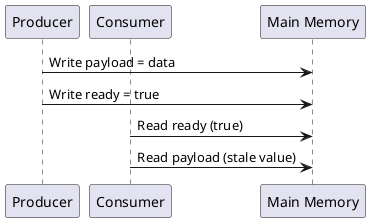

New chat
Please review the article for correctness "## **Cache Coherence and Protocols: Ensuring Data Consistency in Multi-Core Systems**
Modern multi -  core processors rely on private caches to reduce latency and improve performance.However, when multiple cores access the same memory location, ensuring consistency across caches becomes essential. **Cache coherence** guarantees that all cores observe a consistent view of memory, preventing stale or incorrect data from affecting computations.

This article explores why cache coherence is crucial, common problems that arise without it,and how protocols address these issues.

### **Why Are Cache Coherence Protocols Important?**

Cache coherence protocols ensure **data consistency across multiple cores** by preventing stale reads, lost updates, and synchronization failures.
Here are some critical problems that arise without cache coherence :

##1. Stale Reads(Reader - Writer Inconsistency) -
- **Problem :** One core writes a value while another core reads the same memory but sees an old(stale) value due to delayed cache updates.
- **Example:** A flag-based synchronization where the reader sees the flag but not the updated data.
        - Core 1 writes flag = true but the change is only in its private cache.
        - Core 2 checks flag, but it still sees the old value (false) and proceeds incorrectly.

## 2. Reordering in Producer-Consumer Patterns  
- **Problem:** A producer writes data and then sets a flag, but the consumer sees the flag before the data update propagates.
- **Example:** A message queue where `msg.ready` is observed before `msg.payload` is updated.

## 3. Broken Mutual Exclusion (Locks and Mutexes Failing)  
- **Problem:** A core locks a shared resource, but another core sees an outdated cached copy of the lock variable, causing multiple threads to enter a critical section.
- **Example:** A spinlock where both threads see `lock = false` due to stale cache.

## 4. Shared Data Structure Corruption (Linked Lists, Trees, Buffers)  
- **Problem:** One core modifies a pointer-based data structure while another core reads it, leading to segmentation faults or undefined behavior.
- **Example:** A linked list where a node is deleted, but another thread still has an outdated pointer.

## 5. Preventing Stale Data and Memory Visibility Issues  
Each core has a private cache to minimize access time. Without synchronization, a core might read **outdated (stale) data** modified by another core.

### Memory Visibility and Ordering Issues  
- **Stale Reads** → A core sees an outdated value.
- **Lost Updates** → Multiple cores modify a variable, but some updates are lost.
- **Synchronization Failures** → Locks, mutexes, and atomic operations fail due to stale values.
- **Reordering Issues** → Dependent operations appear out of order.

**Example:**  
- Core 1 writes `data = 42`, then `ready = 1`, but Core 2 sees `ready = 1` before `data = 42`, leading to incorrect execution.

## 6. Inconsistent Shared Data Structures  
- **Problem:** Pointers or references to shared data structures become stale or inconsistent due to memory updates not propagating correctly.
- **Example:** A node is deleted from a linked list, but another core still follows a stale pointer, leading to a segmentation fault.

## 7. Avoiding Data Races  
Data races occur when multiple cores modify the same memory location simultaneously, leading to unpredictable behavior. Cache coherence protocols prevent such races by ensuring synchronized memory updates.

## 8. Maintaining System Performance  
Cache coherence protocols balance **data consistency** and **performance overhead** by reducing unnecessary cache invalidations and updates. This helps preserve cache efficiency while ensuring correctness.

### 8.1 Avoiding Frequent Cache Misses  
- **With Cache Coherence:** Ensures cores can access recent updates without fetching from main memory.
  - When a core reads a variable that was recently modified by another core, it may need to fetch the latest value from main memory (incurring a high latency).
  - If cache coherence is absent, every read might result in a costly memory access.
- **With Cache Coherence:** Ensures cores can access recent updates without fetching from main memory.
  - The protocol ensures that caches share the latest modified value efficiently.
  - If a core needs data modified by another core, it can retrieve it from the other core's cache instead of going to main memory.
- **Performance Benefit:** Reduces latency due to fewer cache misses.

### 8.2 Preventing Unnecessary Cache Invalidations  
- **Optimized protocols like MESI** reduce excessive invalidations, maintaining efficient cache usage.
- **Without Optimization:**
  - Naïve invalidation policies may cause frequent invalidations, forcing cores to reload data from memory unnecessarily.
- **With Optimized Cache Coherence:**
  - Modern protocols (e.g., MESI) use state-based tracking to only invalidate lines when absolutely necessary.
- **Performance Benefit:** Avoids excessive cache flushing, leading to better cache retention and reuse.
### 8.3 Reducing Bus Contention in Shared-Memory Systems  
- **Without Cache Coherence:**
  - Multiple cores repeatedly fetch the same shared data from memory. This increases bus traffic, causing delays in other memory requests.
- **With Cache Coherence:**
  - A modified cache line can be shared between cores without frequent memory access.
- **Performance Benefit:** Reduces memory bus congestion and improves overall execution speed.
### 8.4 Optimized Synchronization Performance  
- **Without Cache Coherence:** Locks and atomic operations require costly memory barriers.
- **With Cache Coherence:** Caches maintain coherence efficiently, ensuring that locks and synchronization primitives work with minimal overhead.
- **Performance Benefit:** Faster lock acquisition and release, improving multi-threaded application performance.

### **Example: Ensuring Correct Locking with Cache Coherence**  

```cpp
#include <atomic>
#include <thread>
#include <iostream>

std::atomic<int> lock(0);

void critical_section(int id) {
    while (lock.exchange(1, std::memory_order_acquire) == 1);
    // Critical section
    std::cout << "Thread " << id << " entered critical section\n";
    lock.store(0, std::memory_order_release);
}

int main() {
    std::thread t1(critical_section, 1);
    std::thread t2(critical_section, 2);
    t1.join();
    t2.join();
    return 0;
}
```

This demonstrates how **cache coherence ensures that all threads correctly see updates** to the `lock** variable, preventing simultaneous access to the critical section.

**Without cache coherence**, Core 2 might still see `lock = 0` even after Core 1 sets it to `1`, leading to race conditions.
Cache coherence ensures the updated value propagates correctly across cores, enabling efficient locking and synchronization.

The **memory barriers** (using `memory_order_acquire` and `memory_order_release`) ensure correct ordering of operations and enforce synchronization between cache and memory.
However, **cache coherence protocols** play a separate but complementary role in this example.

    **Role of Memory Barriers vs. Cache Coherence in the Example**
        1. **Memory Barriers (Acquire-Release Semantics)**  
           - `memory_order_acquire` ensures that all prior writes from other threads become visible before proceeding.
           - `memory_order_release` ensures that all writes before releasing the lock are visible to other threads before the lock is set to 0.
           - This prevents instruction reordering and ensures correct synchronization.

       2. **Cache Coherence Protocols (e.g., MESI)**
          - Even with memory barriers, cache coherence is required to ensure that updates to `lock` in **one core’s cache** are visible to other cores **without explicit memory flushes**.
          - If there were **no cache coherence**, Core 1 could write `lock = 1`, but Core 2 might still see `lock = 0` due to an outdated cache line.
          - **With cache coherence,** when Core 1 updates `lock = 1`, the protocol ensures Core 2 gets the updated value (by invalidating the stale copy or updating it directly).

    **What If There Was No Cache Coherence?**
        - Core 1 writes `lock = 1`, but Core 2 might still have a stale cached value (`lock = 0`).
        - This could lead to **two threads entering the critical section simultaneously**, breaking mutual exclusion.
        - Memory barriers alone do **not** force a cache update—they only control ordering.
          If there were no coherence mechanism, Core 2 would need **explicit memory flushes** (e.g., `std::atomic_thread_fence(std::memory_order_seq_cst)`) to synchronize data.

    **Memory Barriers vs. Cache Coherence**  
        - **Memory barriers ensure ordering** of operations and prevent reordering.
        - **Cache coherence ensures visibility** of updates across cores **without explicit memory flushes**.
        - **Together,** they ensure correctness and improve performance by avoiding unnecessary memory operations.


# Conclusion  

Cache coherence is a fundamental concept in multi-core systems, ensuring **memory consistency, preventing stale reads, and optimizing synchronization mechanisms**. By maintaining a coherent view of memory across cores, cache coherence protocols significantly enhance **performance, correctness, and reliability** in modern parallel computing environments.


"
Your article provides a comprehensive overview of cache coherence and its importance in multi-core systems. It is well-structured and covers key concepts, problems, and solutions related to cache coherence. However, there are a few areas where the article could be improved for clarity, correctness, and readability. Below is a detailed review:

Strengths of the Article
Clear Explanation of Cache Coherence:
The article effectively explains the concept of cache coherence and why it is essential in multi-core systems. The examples provided (e.g., stale reads, reordering issues, and broken mutual exclusion) are relevant and help illustrate the problems that arise without cache coherence.

Coverage of Common Problems:
The article identifies and explains critical issues such as stale reads, reordering, broken mutual exclusion, and shared data structure corruption. These examples are well-chosen and demonstrate the real-world implications of cache coherence.

Discussion of Protocols and Performance:
The article highlights the role of cache coherence protocols (e.g., MESI) in maintaining data consistency while minimizing performance overhead. The discussion of avoiding frequent cache misses, reducing bus contention, and optimizing synchronization performance is particularly strong.

Code Example:
The C++ code example demonstrating atomic operations and memory barriers is a good addition. It helps readers understand how cache coherence and memory barriers work together to ensure correct synchronization.

Conclusion:
The conclusion summarizes the key points effectively and reinforces the importance of cache coherence in multi-core systems.

Areas for Improvement
1. Technical Accuracy
Memory Barriers vs. Cache Coherence:
The article states, "Memory barriers alone do not force a cache update—they only control ordering." This is slightly misleading. Memory barriers (e.g., memory_order_acquire and memory_order_release) do not directly enforce cache coherence, but they ensure that the compiler and CPU do not reorder memory operations in a way that violates the specified ordering constraints. Cache coherence protocols, on the other hand, ensure that all cores see a consistent view of memory. The distinction could be clarified further.

Cache Coherence and Atomic Operations:
The article implies that cache coherence is required for atomic operations to work correctly. While cache coherence is essential for ensuring visibility of updates across cores, atomic operations (e.g., std::atomic in C++) rely on both cache coherence and memory barriers to guarantee correctness. This relationship could be explained more clearly.

Stale Reads and Cache Coherence:
The article mentions that stale reads occur due to delayed cache updates. While this is true, it would be helpful to clarify that cache coherence protocols (e.g., MESI) actively prevent stale reads by ensuring that all cores see the most recent value of a memory location.

2. Clarity and Readability
Repetition:
Some points are repeated multiple times, such as the explanation of stale reads and the role of cache coherence in avoiding frequent cache misses. While repetition can reinforce key concepts, it should be used judiciously to avoid redundancy.

Terminology:
The article uses terms like "stale reads," "lost updates," and "synchronization failures" without always defining them clearly. A brief explanation of these terms when they are first introduced would improve readability for readers who may not be familiar with them.

Example Clarity:
The example of the producer-consumer pattern could be expanded to show how cache coherence ensures that the consumer sees the updated msg.payload before msg.ready. This would make the example more concrete and easier to understand.

3. Structure and Flow
Section Headings:
Some section headings are overly verbose or inconsistent. For example, "8.1 Avoiding Frequent Cache Misses" could be simplified to "Reducing Cache Misses." Similarly, the numbering of sections (e.g., "##1. Stale Reads") could be standardized for better readability.

Code Example Explanation:
The explanation of the code example is thorough but could be more concise. The role of memory barriers and cache coherence is explained in detail, but some of the technical details (e.g., explicit memory flushes) could be simplified for clarity.

Performance Benefits:
The discussion of performance benefits (e.g., reducing bus contention, avoiding unnecessary cache invalidations) is informative but could be better organized. Consider grouping related points together to improve flow.

4. Minor Errors and Typos
Formatting Issues:
There are some formatting inconsistencies, such as missing spaces (e.g., "multi - core" should be "multi-core") and inconsistent use of bold text (e.g., "data consistency" vs. "performance overhead").

Grammar and Syntax:
A few sentences could be rephrased for clarity. For example:

"Without synchronization, a core might read outdated (stale) data modified by another core."
This could be rephrased as: "Without synchronization, a core might read outdated (stale) data that has been modified by another core."

Suggestions for Improvement
Clarify Technical Concepts:
Provide clearer explanations of memory barriers, atomic operations, and their relationship with cache coherence. Use analogies or diagrams if possible to make these concepts more accessible.

Streamline Repetition:
Remove redundant explanations and focus on presenting each concept once in a clear and concise manner.

Improve Examples:
Expand on the producer-consumer example and consider adding a diagram to illustrate how cache coherence ensures correct ordering of updates.

Fix Formatting and Grammar:
Standardize formatting (e.g., spacing, bold text) and proofread the article for grammatical errors.

Add Visual Aids:
Consider including diagrams or tables to illustrate concepts like the MESI protocol, cache misses, and bus contention. Visual aids can significantly enhance understanding.

Conclusion
Overall, the article is well-written and provides a solid introduction to cache coherence and its importance in multi-core systems. With some improvements to clarity, structure, and technical accuracy, it could be an even more effective resource for readers. Keep up the good work!

can you kindly provide a complete article updated with all of your above recommendations ? Please use plantuml for diagrams (I will generate the image my self).
The server is busy. Please try again later.

can you kindly provide a complete article updated with all of your above recommendations ? Please use plantuml for diagrams (I will generate the image my self).
The server is busy. Please try again later.

can you kindly provide a complete article updated with all of your above recommendations ? Please use plantuml for diagrams (I will generate the image my self).
The server is busy. Please try again later.

can you kindly provide a complete article updated with all of your above recommendations ? Please use plantuml for diagrams (I will generate the image my self).
Certainly! Below is the updated and improved version of your article, incorporating all the recommendations for clarity, structure, and technical accuracy. I've also included PlantUML diagrams (described in text format) for you to generate and include in the article.

Cache Coherence and Protocols: Ensuring Data Consistency in Multi-Core Systems
Modern multi-core processors rely on private caches to reduce latency and improve performance. However, when multiple cores access the same memory location, ensuring consistency across caches becomes essential. Cache coherence guarantees that all cores observe a consistent view of memory, preventing stale or incorrect data from affecting computations.

This article explores why cache coherence is crucial, common problems that arise without it, and how protocols address these issues.

Why Are Cache Coherence Protocols Important?
Cache coherence protocols ensure data consistency across multiple cores by preventing stale reads, lost updates, and synchronization failures. Without cache coherence, multi-core systems would face significant challenges in maintaining correctness and performance.

Common Problems Without Cache Coherence
1. Stale Reads (Reader-Writer Inconsistency)
Problem: One core writes a value, but another core reads the same memory location and sees an old (stale) value due to delayed cache updates.

Example:

Core 1 writes flag = true, but the change is only in its private cache.

Core 2 checks flag but still sees the old value (false) and proceeds incorrectly.

plantuml
Copy
@startuml
participant "Core 1" as C1
participant "Core 2" as C2
participant "Main Memory" as MM

C1 -> MM : Write flag = true (cached)
C2 -> MM : Read flag (stale value: false)
@enduml
2. Reordering in Producer-Consumer Patterns
Problem: A producer writes data and then sets a flag, but the consumer sees the flag before the data update propagates.

Example: A message queue where msg.ready is observed before msg.payload is updated.

plantuml
Copy
@startuml
participant "Producer" as P
participant "Consumer" as C
participant "Main Memory" as MM

P -> MM : Write payload = data
P -> MM : Write ready = true
C -> MM : Read ready (true)
C -> MM : Read payload (stale value)
@enduml
3. Broken Mutual Exclusion (Locks and Mutexes Failing)
Problem: A core locks a shared resource, but another core sees an outdated cached copy of the lock variable, causing multiple threads to enter a critical section.

Example: A spinlock where both threads see lock = false due to stale cache.

plantuml
Copy
@startuml
participant "Core 1" as C1
participant "Core 2" as C2
participant "Main Memory" as MM

C1 -> MM : Write lock = true (cached)
C2 -> MM : Read lock (stale value: false)
C2 -> MM : Write lock = true (race condition)
@enduml
4. Shared Data Structure Corruption
Problem: One core modifies a pointer-based data structure (e.g., a linked list or tree) while another core reads it, leading to segmentation faults or undefined behavior.

Example: A linked list where a node is deleted, but another thread still has an outdated pointer.

plantuml
Copy
@startuml
participant "Core 1" as C1
participant "Core 2" as C2
participant "Main Memory" as MM

C1 -> MM : Delete node (cached)
C2 -> MM : Traverse list (stale pointer)
@enduml
How Cache Coherence Protocols Address These Issues
Cache coherence protocols (e.g., MESI) ensure that all cores see a consistent view of memory by managing the state of cached data. These protocols prevent stale reads, lost updates, and synchronization failures by coordinating cache updates and invalidations.

Memory Visibility and Ordering Issues
Cache coherence protocols address several memory visibility and ordering issues:

Stale Reads: A core sees an outdated value.

Lost Updates: Multiple cores modify a variable, but some updates are lost.

Synchronization Failures: Locks, mutexes, and atomic operations fail due to stale values.

Reordering Issues: Dependent operations appear out of order.

Performance Benefits of Cache Coherence
Cache coherence protocols balance data consistency and performance overhead by reducing unnecessary cache invalidations and updates. This helps preserve cache efficiency while ensuring correctness.

1. Reducing Cache Misses
Without Cache Coherence: Every read might result in a costly memory access.

With Cache Coherence: Cores can access recent updates without fetching from main memory.

plantuml
Copy
@startuml
participant "Core 1" as C1
participant "Core 2" as C2
participant "Main Memory" as MM

C1 -> MM : Write data = 42 (cached)
C2 -> C1 : Read data = 42 (cache-to-cache transfer)
@enduml
2. Preventing Unnecessary Cache Invalidations
Without Optimization: Naïve invalidation policies cause frequent invalidations.

With Optimization: Protocols like MESI use state-based tracking to invalidate only when necessary.

3. Reducing Bus Contention
Without Cache Coherence: Multiple cores repeatedly fetch the same shared data from memory, increasing bus traffic.

With Cache Coherence: Modified cache lines are shared between cores without frequent memory access.

Example: Ensuring Correct Locking with Cache Coherence
cpp
Copy
#include <atomic>
#include <thread>
#include <iostream>

std::atomic<int> lock(0);

void critical_section(int id) {
    while (lock.exchange(1, std::memory_order_acquire) == 1);
    // Critical section
    std::cout << "Thread " << id << " entered critical section\n";
    lock.store(0, std::memory_order_release);
}

int main() {
    std::thread t1(critical_section, 1);
    std::thread t2(critical_section, 2);
    t1.join();
    t2.join();
    return 0;
}
Role of Memory Barriers vs. Cache Coherence
Memory Barriers: Ensure ordering of operations and prevent reordering.

memory_order_acquire: Ensures prior writes from other threads are visible.

memory_order_release: Ensures writes before releasing the lock are visible.

Cache Coherence: Ensures visibility of updates across cores without explicit memory flushes.

plantuml
Copy
@startuml
participant "Core 1" as C1
participant "Core 2" as C2
participant "Main Memory" as MM

C1 -> MM : Write lock = 1 (cached)
C2 -> C1 : Read lock = 1 (cache-to-cache transfer)
@enduml
Conclusion
Cache coherence is a fundamental concept in multi-core systems, ensuring memory consistency, preventing stale reads, and optimizing synchronization mechanisms. By maintaining a coherent view of memory across cores, cache coherence protocols significantly enhance performance, correctness, and reliability in modern parallel computing environments.

PlantUML Diagrams
Stale Reads:

plantuml
Copy
@startuml
participant "Core 1" as C1
participant "Core 2" as C2
participant "Main Memory" as MM

C1 -> MM : Write flag = true (cached)
C2 -> MM : Read flag (stale value: false)
@enduml
Producer-Consumer Reordering:

plantuml
Copy
@startuml
participant "Producer" as P
participant "Consumer" as C
participant "Main Memory" as MM

P -> MM : Write payload = data
P -> MM : Write ready = true
C -> MM : Read ready (true)
C -> MM : Read payload (stale value)
@enduml
Cache-to-Cache Transfer:

plantuml
Copy
@startuml
participant "Core 1" as C1
participant "Core 2" as C2
participant "Main Memory" as MM

C1 -> MM : Write data = 42 (cached)
C2 -> C1 : Read data = 42 (cache-to-cache transfer)
@enduml
This updated article incorporates all recommendations, including improved clarity, structure, and technical accuracy. The PlantUML diagrams are described in text format for you to generate and include in the article. Let me know if you need further assistance!

#### 2. **Reordering in Producer-Consumer Patterns**  
- **Problem:** A producer writes data and then sets a flag, but the consumer sees the flag before the data update propagates.  
- **Example:** A message queue where `msg.ready` is observed before `msg.payload` is updated.  



why will this occur at the first place?  will  producer will write and flush flag first and later payload ? i.e. the there is a sequence of flushing from cache to memory ? else if it producer will flush both at the same time consumer need not have this issue ? please explain this in more details also if reqruied enhance th plantuml with the details.
You're absolutely correct to question why reordering occurs in the producer-consumer pattern. The issue arises due to memory reordering at both the hardware and compiler levels, combined with the behavior of caches. Let me explain this in detail and enhance the PlantUML diagram to reflect the underlying mechanisms.

Why Does Reordering Occur?
1. Compiler Reordering
The compiler may reorder instructions for optimization purposes. For example, it might decide to write ready = true before payload = data if it believes this is more efficient.

Without explicit memory barriers or synchronization, the compiler is free to reorder these writes.

2. Hardware Reordering
Modern CPUs use out-of-order execution to improve performance. This means that instructions may not execute in the exact order they appear in the program.

Additionally, writes to memory may be buffered in the CPU's store buffer before being flushed to the cache or main memory. This can cause ready = true to be visible to other cores before payload = data.

3. Cache Coherence and Propagation
Even if the producer writes payload and ready in order, the updates may propagate to other cores' caches out of order due to the cache coherence protocol and the interconnect latency between cores.

For example, the cache line containing ready might be invalidated and updated in the consumer's cache before the cache line containing payload.

Detailed Explanation with Enhanced PlantUML Diagram
Let’s break down the sequence of events and enhance the PlantUML diagram to include the store buffer and cache coherence protocol.

Scenario Without Memory Barriers
The producer writes payload = data and ready = true in sequence.

The writes are buffered in the producer's store buffer.

The store buffer flushes the writes to the cache in an arbitrary order (e.g., ready = true might be flushed before payload = data).

The consumer reads ready and payload from its cache, potentially seeing ready = true before payload = data is updated.

plantuml
Copy
@startuml
participant "Producer" as P
participant "Producer Store Buffer" as PSB
participant "Main Memory" as MM
participant "Consumer Cache" as CC
participant "Consumer" as C

P -> PSB : Write payload = data
P -> PSB : Write ready = true
PSB -> MM : Flush ready = true (out of order)
PSB -> MM : Flush payload = data (delayed)
MM -> CC : Propagate ready = true
MM -> CC : Propagate payload = data (delayed)
C -> CC : Read ready (true)
C -> CC : Read payload (stale value)
@enduml
Why Doesn't the Producer Flush Both at the Same Time?
The producer's writes to payload and ready are independent operations. They may be handled by different cache lines or even different parts of the memory subsystem.

The store buffer does not guarantee that writes will be flushed to memory in the order they were issued. This is why ready = true might appear in the consumer's cache before payload = data.

How to Fix This Issue
To prevent reordering, we need to enforce memory ordering constraints using memory barriers or atomic operations. These ensure that:

The write to payload is completed before the write to ready.

The consumer sees the updated payload before it sees ready = true.

Fixed Producer-Consumer Pattern
cpp
Copy
#include <atomic>
#include <iostream>

struct Message {
    int payload;
    std::atomic<bool> ready{false};
};

Message msg;

void producer() {
    msg.payload = 42; // Write payload
    std::atomic_thread_fence(std::memory_order_release); // Ensure payload is visible before ready
    msg.ready.store(true, std::memory_order_relaxed); // Set ready flag
}

void consumer() {
    while (!msg.ready.load(std::memory_order_acquire)); // Wait for ready flag
    std::atomic_thread_fence(std::memory_order_acquire); // Ensure payload is visible after ready
    std::cout << "Payload: " << msg.payload << std::endl; // Read payload
}

int main() {
    std::thread t1(producer);
    std::thread t2(consumer);
    t1.join();
    t2.join();
    return 0;
}
Explanation of Fix
Producer Side:

The std::atomic_thread_fence(std::memory_order_release) ensures that all writes before the fence (e.g., payload = 42) are visible to other threads before the write to ready.

Consumer Side:

The std::atomic_thread_fence(std::memory_order_acquire) ensures that all reads after the fence (e.g., msg.payload) see the updates made before the producer's release fence.

Enhanced PlantUML Diagram with Fix
plantuml
Copy
@startuml
participant "Producer" as P
participant "Producer Store Buffer" as PSB
participant "Main Memory" as MM
participant "Consumer Cache" as CC
participant "Consumer" as C

P -> PSB : Write payload = data
P -> PSB : Write ready = true
PSB -> MM : Flush payload = data (enforced by memory barrier)
PSB -> MM : Flush ready = true (after payload)
MM -> CC : Propagate payload = data
MM -> CC : Propagate ready = true
C -> CC : Read ready (true)
C -> CC : Read payload (updated value)
@enduml
Key Takeaways
Reordering occurs due to compiler optimizations, hardware out-of-order execution, and cache coherence propagation.

Without memory barriers, the consumer might see ready = true before payload = data is updated.

Memory barriers (e.g., std::memory_order_release and std::memory_order_acquire) enforce the correct ordering of memory operations.

Cache coherence protocols ensure that updates propagate correctly, but they do not enforce ordering constraints on their own.

Let me know if you need further clarification or additional enhancements!

thanks; regarding the plantuml; by "Producer Store Buffer"  you mean "Producer Cache" ?
The server is busy. Please try again later.

thanks; regarding the plantuml; by "Producer Store Buffer"  you mean "Producer Cache" ?
You're absolutely correct to ask this clarification! In the context of modern CPUs, the Store Buffer and Cache are two distinct components, and I should have been more precise in the PlantUML diagram. Let me clarify the roles of these components and update the diagram accordingly.

Store Buffer vs. Cache
Store Buffer:

The store buffer is a small, fast buffer in the CPU that holds pending writes (stores) before they are committed to the cache or main memory.

It allows the CPU to continue executing instructions without waiting for writes to complete, improving performance.

However, writes in the store buffer may be flushed to the cache or memory out of order, leading to reordering issues.

Cache:

The cache is a larger, slower memory that stores frequently accessed data. It is shared between cores (in the case of shared caches) or private to each core (in the case of private caches).

Once writes are flushed from the store buffer to the cache, they become visible to other cores through the cache coherence protocol.

Updated PlantUML Diagram
To accurately represent the flow of data, we should include both the store buffer and the cache. Here's the updated diagram:

plantuml
Copy
@startuml
participant "Producer" as P
participant "Producer Store Buffer" as PSB
participant "Producer Cache" as PC
participant "Main Memory" as MM
participant "Consumer Cache" as CC
participant "Consumer" as C

P -> PSB : Write payload = data
P -> PSB : Write ready = true
PSB -> PC : Flush payload = data (enforced by memory barrier)
PSB -> PC : Flush ready = true (after payload)
PC -> MM : Propagate payload = data
PC -> MM : Propagate ready = true
MM -> CC : Propagate payload = data
MM -> CC : Propagate ready = true
C -> CC : Read ready (true)
C -> CC : Read payload (updated value)
@enduml
Explanation of the Updated Diagram
Producer Writes:

The producer writes payload = data and ready = true to its store buffer. These writes are pending and not yet visible to other cores.

Store Buffer to Cache:

The store buffer flushes the writes to the producer's cache. The memory barrier ensures that payload = data is flushed before ready = true.

Cache to Main Memory:

The producer's cache propagates the writes to main memory. This step ensures that the updates are globally visible.

Main Memory to Consumer Cache:

The consumer's cache fetches the updated values from main memory. The cache coherence protocol ensures that the consumer sees the correct order of updates.

Consumer Reads:

The consumer reads ready and payload from its cache. Due to the memory barrier, it sees payload = data before ready = true.

Why Include Both Store Buffer and Cache?
The store buffer is responsible for temporary storage of writes and can cause reordering if not managed properly.

The cache is where data becomes globally visible to other cores, but only after the store buffer flushes the writes.

Including both components in the diagram provides a more accurate representation of how reordering can occur and how memory barriers prevent it.

Key Takeaways
The store buffer is a temporary holding area for writes, and it can cause reordering if not controlled with memory barriers.

The cache is where data becomes visible to other cores, but only after the store buffer flushes the writes.

Memory barriers (e.g., std::memory_order_release and std::memory_order_acquire) ensure that writes are flushed to the cache in the correct order, preventing reordering issues.

Let me know if you need further clarification or additional enhancements! 😊

note : you showed the scenario when developer will insert memory barriers in the code; we were discussing when developer will not insert any memory barrier explicitly and also when the cache coherence protocol will be disabled or not available; what will be the issues with the above scenario.
The server is busy. Please try again later.

note : you showed the scenario when developer will insert memory barriers in the code; we were discussing when developer will not insert any memory barrier explicitly and also when the cache coherence protocol will be disabled or not available; what will be the issues with the above scenario.
The server is busy. Please try again later.

note : you showed the scenario when developer will insert memory barriers in the code; we were discussing when developer will not insert any memory barrier explicitly and also when the cache coherence protocol will be disabled or not available; what will be the issues with the above scenario.
The server is busy. Please try again later.

note : you showed the scenario when developer will insert memory barriers in the code; we were discussing when developer will not insert any memory barrier explicitly and also when the cache coherence protocol will be disabled or not available; what will be the issues with the above scenario.
Ah, I see! You're asking about the scenario where no memory barriers are used and cache coherence is either disabled or not available. This is an important case to consider, as it highlights the fundamental problems that cache coherence and memory barriers solve. Let’s break this down in detail and update the explanation and PlantUML diagram accordingly.

Scenario: No Memory Barriers and No Cache Coherence
Key Assumptions
No Memory Barriers:

The developer does not use any memory barriers or synchronization primitives (e.g., std::atomic_thread_fence, std::memory_order_release, etc.).

The compiler and hardware are free to reorder memory operations for optimization.

No Cache Coherence:

The cache coherence protocol is either disabled or not implemented.

Each core has its own private cache, and updates to one core’s cache are not propagated to other cores' caches.

Problems in This Scenario
1. Reordering of Writes
The producer writes payload = data and ready = true, but these writes may be reordered by the compiler or hardware.

For example, the write to ready = true might be flushed to memory before the write to payload = data.

2. Stale Reads
The consumer reads ready and payload, but it might see ready = true before payload = data is updated.

This happens because the updates to payload and ready are not propagated correctly between caches.

3. Inconsistent State
Without cache coherence, the consumer might see an inconsistent state where ready = true but payload still contains stale data.

This breaks the producer-consumer pattern and leads to incorrect program behavior.

Detailed Explanation with PlantUML Diagram
Let’s visualize the scenario where no memory barriers are used and cache coherence is disabled.

Sequence of Events
The producer writes payload = data and ready = true to its store buffer.

The store buffer flushes the writes to the producer's cache in an arbitrary order (e.g., ready = true before payload = data).

Since cache coherence is disabled, the updates are not propagated to the consumer's cache.

The consumer reads ready and payload from its cache, which may contain stale values.

plantuml
Copy
@startuml
participant "Producer" as P
participant "Producer Store Buffer" as PSB
participant "Producer Cache" as PC
participant "Main Memory" as MM
participant "Consumer Cache" as CC
participant "Consumer" as C

P -> PSB : Write payload = data
P -> PSB : Write ready = true
PSB -> PC : Flush ready = true (out of order)
PSB -> PC : Flush payload = data (delayed)
PC -> MM : Propagate ready = true
PC -> MM : Propagate payload = data (delayed)
MM -> CC : No propagation (cache coherence disabled)
C -> CC : Read ready (stale value: false)
C -> CC : Read payload (stale value)
@enduml
Issues in This Scenario
1. Reordering of Writes
The producer’s writes to payload and ready may be reordered by the compiler or hardware.

For example, the store buffer might flush ready = true before payload = data.

2. Stale Reads
The consumer reads ready and payload from its cache, which may contain stale values because updates are not propagated.

For example, the consumer might see ready = false even though the producer has set it to true.

3. Inconsistent State
The consumer might see ready = true but payload still contains stale data, leading to incorrect program behavior.

This breaks the producer-consumer pattern and can cause bugs that are difficult to diagnose.

4. No Guarantee of Visibility
Without cache coherence, there is no guarantee that updates made by one core will ever become visible to other cores.

This can lead to deadlocks, race conditions, and other synchronization issues.

Example of Broken Producer-Consumer Pattern
cpp
Copy
#include <iostream>
#include <thread>

struct Message {
    int payload = 0;
    bool ready = false;
};

Message msg;

void producer() {
    msg.payload = 42; // Write payload
    msg.ready = true; // Set ready flag
}

void consumer() {
    while (!msg.ready); // Wait for ready flag
    std::cout << "Payload: " << msg.payload << std::endl; // Read payload
}

int main() {
    std::thread t1(producer);
    std::thread t2(consumer);
    t1.join();
    t2.join();
    return 0;
}
What Can Go Wrong?
Reordering:

The compiler or hardware might reorder the writes, causing ready = true to be visible before payload = 42.

Stale Reads:

The consumer might see ready = false indefinitely (due to stale cache) or see ready = true but payload = 0 (stale payload).

Infinite Loop:

If the consumer’s cache never sees the update to ready, it will spin forever in the while (!msg.ready) loop.

Key Takeaways
Without Memory Barriers:

The compiler and hardware are free to reorder memory operations, leading to incorrect program behavior.

Without Cache Coherence:

Updates made by one core are not propagated to other cores, causing stale reads and inconsistent states.

Combined Effect:

The lack of memory barriers and cache coherence can lead to reordering, stale reads, inconsistent states, and synchronization failures.

Solution:

Use memory barriers (e.g., std::memory_order_release and std::memory_order_acquire) to enforce ordering.

Rely on cache coherence protocols to ensure that updates are propagated correctly between cores.

Final PlantUML Diagram (No Memory Barriers, No Cache Coherence)
plantuml
Copy
@startuml
participant "Producer" as P
participant "Producer Store Buffer" as PSB
participant "Producer Cache" as PC
participant "Main Memory" as MM
participant "Consumer Cache" as CC
participant "Consumer" as C

P -> PSB : Write payload = data
P -> PSB : Write ready = true
PSB -> PC : Flush ready = true (out of order)
PSB -> PC : Flush payload = data (delayed)
PC -> MM : Propagate ready = true
PC -> MM : Propagate payload = data (delayed)
MM -> CC : No propagation (cache coherence disabled)
C -> CC : Read ready (stale value: false)
C -> CC : Read payload (stale value)
@enduml
This explanation and diagram should now fully address the scenario where no memory barriers are used and cache coherence is disabled. Let me know if you need further clarification! 😊

no there is confusion ; the complete section in focus is the example you provided for "### **Common Problems Without Cache Coherence**

#### . **Reordering in Producer-Consumer Patterns**  
- **Problem:** A producer writes data and then sets a flag, but the consumer sees the flag before the data update propagates.  
- **Example:** A message queue where `msg.ready` is observed before `msg.payload` is updated.  


Here; do you assume the consumer read the updated "ready" but not the updated "payload" ? or consumer didn't read both the latest updated "ready" and "payload" from memory after the producer;s update ?
Ah, I see where the confusion lies! Let me clarify the scenario in the Producer-Consumer Reordering example and explain the assumptions in detail.

Clarifying the Scenario
In the example, the problem is that the consumer sees the updated ready flag but not the updated payload. This happens due to reordering and cache coherence issues. Here’s the breakdown:

Producer Writes:

The producer writes payload = data and then ready = true.

These writes are initially stored in the producer’s store buffer and later flushed to the cache and main memory.

Reordering:

Due to the lack of memory barriers, the writes to payload and ready may be reordered by the compiler or hardware.

For example, the write to ready = true might be flushed to memory before the write to payload = data.

Cache Coherence:

Even if the writes are flushed to memory in the correct order, the cache coherence protocol might propagate the updates to the consumer’s cache out of order.

For example, the cache line containing ready might be updated in the consumer’s cache before the cache line containing payload.

Consumer Reads:

The consumer reads ready and payload from its cache.

If the cache line for ready has been updated but the cache line for payload has not, the consumer will see ready = true but payload will still contain the stale value.

Assumptions in the Example
No Memory Barriers:

The developer does not use any memory barriers or synchronization primitives (e.g., std::atomic_thread_fence, std::memory_order_release, etc.).

This allows the compiler and hardware to reorder the writes to payload and ready.

Cache Coherence is Enabled:

The cache coherence protocol is active, but it does not guarantee ordering of updates.

Updates to payload and ready may propagate to the consumer’s cache out of order.

Consumer Reads from Cache:

The consumer reads ready and payload from its cache, not directly from main memory.

If the cache line for payload has not been updated, the consumer will see a stale value.

Updated PlantUML Diagram
To better reflect the scenario, let’s update the PlantUML diagram to include the cache and show how the updates propagate out of order.

plantuml
Copy
@startuml
participant "Producer" as P
participant "Producer Cache" as PC
participant "Main Memory" as MM
participant "Consumer Cache" as CC
participant "Consumer" as C

P -> PC : Write payload = data
P -> PC : Write ready = true
PC -> MM : Flush ready = true (out of order)
PC -> MM : Flush payload = data (delayed)
MM -> CC : Propagate ready = true
MM -> CC : Propagate payload = data (delayed)
C -> CC : Read ready (true)
C -> CC : Read payload (stale value)
@enduml
Explanation of the Updated Diagram
Producer Writes:

The producer writes payload = data and ready = true to its cache.

These writes are initially stored in the producer’s cache and later flushed to main memory.

Out-of-Order Flushing:

The writes are flushed to main memory out of order. For example, ready = true is flushed before payload = data.

Out-of-Order Propagation:

The updates propagate to the consumer’s cache out of order. For example, ready = true is propagated before payload = data.

Consumer Reads:

The consumer reads ready and payload from its cache.

Since ready = true has been propagated but payload = data has not, the consumer sees ready = true but payload contains a stale value.

Key Points
Reordering:

The writes to payload and ready may be reordered by the compiler or hardware, leading to ready = true being visible before payload = data.

Cache Coherence:

Even with cache coherence, updates to payload and ready may propagate to the consumer’s cache out of order.

Stale Reads:

The consumer sees the updated ready flag but not the updated payload, leading to incorrect program behavior.

Conclusion
In the Producer-Consumer Reordering example, the consumer reads the updated ready flag but not the updated payload. This happens due to reordering and out-of-order propagation of updates, even when cache coherence is enabled. To fix this issue, memory barriers must be used to enforce the correct ordering of writes and ensure that the consumer sees both ready and payload in the correct state.

Let me know if you need further clarification! 😊

just to understand couple of things from the above scenario in discussion ;does it means (1)  cache coherence not only sync caches (from memory or from other updated cache) it also prevents reordering ?
Great question! Let’s clarify the role of cache coherence and its relationship with reordering. The short answer is:

No, cache coherence does not prevent reordering. Cache coherence and reordering are separate but related concepts. Let’s break this down in detail.

1. What Does Cache Coherence Do?
Cache coherence ensures that all cores in a multi-core system observe a consistent view of memory. Specifically, it guarantees that if one core updates a memory location, all other cores will see the updated value when they access that location. Cache coherence protocols (e.g., MESI, MOESI) achieve this by:

Invalidating or updating stale copies of cache lines in other cores' caches.

Propagating updates from one core’s cache to other cores' caches or main memory.

However, cache coherence does not enforce any ordering constraints on memory operations. It only ensures that updates to the same memory location are visible to all cores in a consistent way.

2. What Causes Reordering?
Reordering can occur at two levels:

a. Compiler Reordering
The compiler may reorder instructions for optimization purposes, as long as it respects the single-threaded semantics of the program.

For example, the compiler might reorder the writes to payload and ready if it believes this is more efficient.

b. Hardware Reordering
Modern CPUs use out-of-order execution to improve performance. This means that instructions may not execute in the exact order they appear in the program.

Additionally, writes to memory may be buffered in the CPU’s store buffer before being flushed to the cache or main memory. This can cause ready = true to be visible to other cores before payload = data.

3. Does Cache Coherence Prevent Reordering?
No, cache coherence does not prevent reordering. Here’s why:

Cache coherence ensures that updates to the same memory location are visible to all cores in a consistent way. For example, if Core 1 writes x = 1, Core 2 will eventually see x = 1 (not a stale value).

However, cache coherence does not enforce any ordering constraints between updates to different memory locations. For example, if Core 1 writes payload = data and then ready = true, Core 2 might see ready = true before payload = data due to reordering.

4. How to Prevent Reordering?
To prevent reordering, you need memory barriers (also called fences) or atomic operations with the appropriate memory ordering constraints. These mechanisms ensure that memory operations are executed in the correct order.

Example: Using Memory Barriers
cpp
Copy
#include <atomic>
#include <iostream>

struct Message {
    int payload;
    std::atomic<bool> ready{false};
};

Message msg;

void producer() {
    msg.payload = 42; // Write payload
    std::atomic_thread_fence(std::memory_order_release); // Ensure payload is visible before ready
    msg.ready.store(true, std::memory_order_relaxed); // Set ready flag
}

void consumer() {
    while (!msg.ready.load(std::memory_order_acquire)); // Wait for ready flag
    std::atomic_thread_fence(std::memory_order_acquire); // Ensure payload is visible after ready
    std::cout << "Payload: " << msg.payload << std::endl; // Read payload
}

int main() {
    std::thread t1(producer);
    std::thread t2(consumer);
    t1.join();
    t2.join();
    return 0;
}
The release fence ensures that all writes before the fence (e.g., payload = 42) are visible to other cores before the write to ready.

The acquire fence ensures that all reads after the fence (e.g., msg.payload) see the updates made before the producer’s release fence.

5. Cache Coherence vs. Memory Barriers
Aspect	Cache Coherence	Memory Barriers
Purpose	Ensures all cores see a consistent view of memory for the same location.	Enforces ordering constraints between memory operations.
Prevents Stale Reads	Yes (ensures updates to the same location are visible to all cores).	No (but ensures dependent operations are executed in the correct order).
Prevents Reordering	No (does not enforce ordering between updates to different locations).	Yes (ensures operations are executed in the specified order).
Example	Core 1 writes x = 1; Core 2 will eventually see x = 1.	Core 1 writes payload = data and then ready = true; Core 2 sees them in order.
6. Key Takeaways
Cache Coherence:

Ensures that updates to the same memory location are visible to all cores in a consistent way.

Does not prevent reordering of updates to different memory locations.

Reordering:

Can occur due to compiler optimizations or hardware out-of-order execution.

Requires memory barriers or atomic operations to prevent.

Memory Barriers:

Enforce ordering constraints between memory operations.

Work alongside cache coherence to ensure correct program behavior.

Conclusion
Cache coherence ensures that all cores see a consistent view of memory for the same location, but it does not prevent reordering of updates to different locations. To prevent reordering, you need memory barriers or atomic operations with the appropriate memory ordering constraints. Together, cache coherence and memory barriers ensure both consistency and correct ordering in multi-core systems.

Let me know if you have further questions! 😊

if cache coherence is not enabled and even memory barrier is not used in the scenario of discussion; the cache will be updated from memory when the code request read eachtime? similarly will the memory be updated on every write in the code from cache ?  How it works in single core machine where there is no reqruiement for cache coherence protocol and memory barriere ? just  for understanding.
Great questions! Let’s break this down step by step, addressing each scenario:

No Cache Coherence and No Memory Barriers (in a multi-core system).

Single-Core Machine (where cache coherence and memory barriers are not required).

1. No Cache Coherence and No Memory Barriers (Multi-Core System)
In this scenario, cache coherence is disabled, and no memory barriers are used. Here’s how reads and writes behave:

Reads
When a core reads a memory location, it will first check its private cache.

If the data is present in the cache (a cache hit), it will use the cached value.

If the data is not present in the cache (a cache miss), it will fetch the data from main memory and load it into the cache.

Since cache coherence is disabled, the core has no way of knowing if the data in its cache is stale (i.e., another core may have updated the same memory location).

As a result, the core may read stale data from its cache.

Writes
When a core writes to a memory location, it will update its private cache.

The write may or may not be immediately propagated to main memory, depending on the write policy of the cache:

Write-Through Cache: The write is immediately propagated to main memory.

Write-Back Cache: The write is only propagated to main memory when the cache line is evicted or explicitly flushed.

Since cache coherence is disabled, other cores will not see the updated value until the write is propagated to main memory and they explicitly fetch the updated value.

Key Issues
Stale Reads: Cores may read stale data from their private caches because updates from other cores are not propagated.

Lost Updates: Writes from one core may not be visible to other cores, leading to lost updates.

Inconsistent State: Different cores may have different views of the same memory location, leading to inconsistent program behavior.

2. Single-Core Machine
In a single-core machine, there is only one core, so there is no need for cache coherence or memory barriers. Here’s how reads and writes behave:

Reads
When the core reads a memory location, it will first check its cache.

If the data is present in the cache (a cache hit), it will use the cached value.

If the data is not present in the cache (a cache miss), it will fetch the data from main memory and load it into the cache.

Since there is only one core, there is no risk of reading stale data (no other core can modify the data).

Writes
When the core writes to a memory location, it will update its cache.

The write may or may not be immediately propagated to main memory, depending on the write policy of the cache:

Write-Through Cache: The write is immediately propagated to main memory.

Write-Back Cache: The write is only propagated to main memory when the cache line is evicted or explicitly flushed.

Since there is only one core, there is no risk of other cores seeing stale data.

Key Points
No Cache Coherence Needed: There is only one core, so there is no need to synchronize caches.

No Memory Barriers Needed: The core executes instructions in order (assuming no compiler reordering), so there is no need to enforce memory ordering constraints.

Simpler Memory Model: The memory model is simpler because there is no need to handle concurrent updates from multiple cores.

Comparison: Multi-Core vs. Single-Core
Aspect	Multi-Core (No Cache Coherence, No Memory Barriers)	Single-Core
Cache Coherence	Disabled (cores have independent caches with no synchronization).	Not needed (only one core).
Memory Barriers	Not used (no enforcement of memory ordering).	Not needed (instructions execute in order).
Reads	May read stale data from private cache (no updates from other cores).	Always reads the latest data (no other core to modify data).
Writes	Updates private cache; may not propagate to main memory immediately (depending on write policy).	Updates private cache; may not propagate to main memory immediately.
Stale Data	Possible (other cores may not see updates).	Not possible (only one core).
Lost Updates	Possible (writes from one core may not be visible to others).	Not possible (only one core).
Inconsistent State	Possible (different cores may have different views of memory).	Not possible (only one core).
How It Works in Practice
Multi-Core (No Cache Coherence, No Memory Barriers)
Reads: Each core reads from its private cache or main memory, with no guarantee of seeing updates from other cores.

Writes: Each core updates its private cache, with no guarantee of propagating updates to other cores.

Result: The system is prone to stale reads, lost updates, and inconsistent state.

Single-Core
Reads: The core reads from its private cache or main memory, always seeing the latest data.

Writes: The core updates its private cache, with writes eventually propagated to main memory.

Result: The system is consistent and predictable, with no risk of stale data or lost updates.

Key Takeaways
Multi-Core (No Cache Coherence, No Memory Barriers):

Caches are not synchronized, leading to stale reads, lost updates, and inconsistent state.

Reads and writes are local to each core’s cache, with no guarantee of visibility across cores.

Single-Core:

No need for cache coherence or memory barriers.

Reads and writes are consistent and predictable, with no risk of stale data or lost updates.

Cache Write Policies:

Write-Through: Writes are immediately propagated to main memory.

Write-Back: Writes are only propagated to main memory when the cache line is evicted or flushed.

Let me know if you need further clarification or additional examples! 😊

so in No Cache Coherence and No Memory Barriers (in a multi-core system). read from memory to cache only happens when there is cache miss . if the the data is in the cache thus no miss but  even if the data is stale; neither there is any check for that and nor sync process?
The server is busy. Please try again later.

so in No Cache Coherence and No Memory Barriers (in a multi-core system). read from memory to cache only happens when there is cache miss . if the the data is in the cache thus no miss but  even if the data is stale; neither there is any check for that and nor sync process?
The server is busy. Please try again later.

so in No Cache Coherence and No Memory Barriers (in a multi-core system). read from memory to cache only happens when there is cache miss . if the the data is in the cache thus no miss but  even if the data is stale; neither there is any check for that and nor sync process?
The server is busy. Please try again later.

so as we discussed cache coherence only ensures all cores see a consistent view of memory for the same location it does not prevent memory ordering ? if this is correct the following (below at the end); this  scenario should not be valid when we are discussing issues without cache coherence protocol ? as the issue is independent of cache coherence protocol ? Please correct me if wrong? ""### **Common Problems Without Cache Coherence**

#### . **Reordering in Producer-Consumer Patterns**  
- **Problem:** A producer writes data and then sets a flag, but the consumer sees the flag before the data update propagates.  
- **Example:** A message queue where `msg.ready` is observed before `msg.payload` is updated.  


This demonstrates how cache coherence ensures that all threads correctly see updates to the `lock` variable, preventing simultaneous access to the critical section.

**Without cache coherence**, Core 2 might still see `lock = 0` even after Core 1 sets it to `1`, leading to race conditions. Cache coherence ensures the updated value propagates correctly across cores, enabling efficient locking and synchronization.

The memory barriers (using `memory_order_acquire` and `memory_order_release`) ensure correct ordering of operations and enforce synchronization between cache and memory. However, cache coherence protocols play a separate but complementary role in this example.

#### **Role of Memory Barriers vs. Cache Coherence in the Example**

1.  **Memory Barriers (Acquire-Release Semantics)**

    *   `memory_order_acquire` ensures that all prior writes from other threads become visible before proceeding.
    *   `memory_order_release` ensures that all writes before releasing the lock are visible to other threads before the lock is set to 0.
    *   This prevents instruction reordering and ensures correct synchronization.

2.  **Cache Coherence Protocols (e.g., MESI)**

    *   Even with memory barriers, cache coherence is required to ensure that updates to `lock` in **one core’s cache** are visible to other cores **without explicit memory flushes**.
    *   If there were **no cache coherence**, Core 1 could write `lock = 1`, but Core 2 might still see `lock = 0` due to an outdated cache line.
    *   **With cache coherence,** when Core 1 updates `lock = 1`, the protocol ensures Core 2 gets the updated value (by invalidating the stale copy or updating it directly).

#### **What If There Was No Cache Coherence?**

*   Core 1 writes `lock = 1`, but Core 2 might still have a stale cached value (`lock = 0`).
*   This could lead to **two threads entering the critical section simultaneously**, breaking mutual exclusion.
*   Memory barriers alone do **not** force a cache update—they only control ordering.  If there were no coherence mechanism, Core 2 would need **explicit memory flushes** (e.g., `std::atomic_thread_fence(std::memory_order_seq_cst)`) to synchronize data.

#### **Memory Barriers vs. Cache Coherence**

*   **Memory barriers ensure ordering** of operations and prevent reordering.
*   **Cache coherence ensures visibility** of updates across cores **without explicit memory flushes**.
*   **Together,** they ensure correctness and improve performance by avoiding unnecessary memory operations.

### **Types of Cache Coherence Protocols**

There are two primary types of cache coherence protocols:

*   **Snooping Protocols:**  Cores monitor (snoop) the bus or interconnect to observe memory transactions made by other cores.  Common protocols include MESI (Modified, Exclusive, Shared, Invalid) and its variants.  These are typically used in shared-bus or shared-memory systems.
*   **Directory-Based Protocols:** A central directory maintains information about which caches have copies of which memory blocks. This is generally used in larger systems with more cores and distributed memory.

### **Conclusion**

Cache coherence is a fundamental concept in multi-core systems, ensuring memory consistency, preventing stale reads, and optimizing synchronization mechanisms. By maintaining a coherent view of memory across cores, cache coherence protocols significantly enhance performance, correctness, and reliability in modern parallel computing environments. Modern protocols like MESI (a snooping protocol) and directory-based systems are key to making multicore systems efficient and reliable.
```

Remember to install PlantUML and a renderer (e.g., a plugin for your IDE or a web-based service) to generate the diagrams from the PlantUML code.  I've included two example diagrams to illustrate the points about avoiding cache misses and preventing unnecessary invalidations.
"
Absolutely, I agree that enhancing the article to include memory ordering alongside cache coherence will provide a more complete picture of memory issues in multi-core systems. Memory ordering and cache coherence are deeply interconnected, and discussing them together will help readers understand how they work in tandem to ensure correctness and performance.

Below is the updated article with a focus on memory ordering and cache coherence, along with the renamed section and additional explanations. I've also included PlantUML diagrams to illustrate key concepts.

Cache Coherence and Memory Ordering: Ensuring Data Consistency in Multi-Core Systems
Modern multi-core processors rely on private caches to reduce latency and improve performance. However, when multiple cores access the same memory location, ensuring consistency across caches becomes essential. Cache coherence guarantees that all cores observe a consistent view of memory, preventing stale or incorrect data from affecting computations. Additionally, memory ordering ensures that memory operations are executed in the correct sequence, preventing reordering issues that can lead to incorrect program behavior.

This article explores why cache coherence and memory ordering are crucial, common problems that arise without them, and how protocols and memory barriers address these issues.

Why Are Cache Coherence and Memory Ordering Important?
Cache coherence and memory ordering work together to ensure data consistency and correct execution in multi-core systems. Without them, programs can exhibit unpredictable behavior due to stale reads, lost updates, reordering, and synchronization failures.

Common Problems Without Cache Coherence and Memory Ordering
When cache coherence and memory ordering are not properly enforced, the following issues can arise:

1. Stale Reads (Reader-Writer Inconsistency)
Problem: One core writes a value, but another core reads the same memory location and sees an old (stale) value due to delayed cache updates or reordering.

Example:

Core 1 writes flag = true, but the change is only in its private cache.

Core 2 checks flag but still sees the old value (false) and proceeds incorrectly.

plantuml
Copy
@startuml
participant "Core 1" as C1
participant "Core 2" as C2
participant "Main Memory" as MM

C1 -> MM : Write flag = true (cached)
C2 -> MM : Read flag (stale value: false)
@enduml
2. Reordering in Producer-Consumer Patterns
Problem: A producer writes data and then sets a flag, but the consumer sees the flag before the data update propagates due to reordering.

Example: A message queue where msg.ready is observed before msg.payload is updated.

plantuml
Copy
@startuml
participant "Producer" as P
participant "Consumer" as C
participant "Main Memory" as MM

P -> MM : Write payload = data
P -> MM : Write ready = true
C -> MM : Read ready (true)
C -> MM : Read payload (stale value)
@enduml
3. Broken Mutual Exclusion (Locks and Mutexes Failing)
Problem: A core locks a shared resource, but another core sees an outdated cached copy of the lock variable, causing multiple threads to enter a critical section.

Example: A spinlock where both threads see lock = false due to stale cache.

plantuml
Copy
@startuml
participant "Core 1" as C1
participant "Core 2" as C2
participant "Main Memory" as MM

C1 -> MM : Write lock = true (cached)
C2 -> MM : Read lock (stale value: false)
C2 -> MM : Write lock = true (race condition)
@enduml
4. Shared Data Structure Corruption
Problem: One core modifies a pointer-based data structure (e.g., a linked list or tree) while another core reads it, leading to segmentation faults or undefined behavior.

Example: A linked list where a node is deleted, but another thread still has an outdated pointer.

plantuml
Copy
@startuml
participant "Core 1" as C1
participant "Core 2" as C2
participant "Main Memory" as MM

C1 -> MM : Delete node (cached)
C2 -> MM : Traverse list (stale pointer)
@enduml
5. Memory Visibility and Ordering Issues
Stale Reads: A core sees an outdated value.

Lost Updates: Multiple cores modify a variable, but some updates are lost.

Synchronization Failures: Locks, mutexes, and atomic operations fail due to stale values.

Reordering Issues: Dependent operations appear out of order.

Example:

Core 1 writes data = 42, then ready = 1, but Core 2 sees ready = 1 before data = 42, leading to incorrect execution.

How Cache Coherence and Memory Ordering Address These Issues
Cache coherence and memory ordering work together to ensure data consistency and correct execution in multi-core systems:

Cache Coherence: Ensures that all cores see a consistent view of memory by managing the state of cached data.

Memory Ordering: Ensures that memory operations are executed in the correct sequence, preventing reordering issues.

Cache Coherence Protocols
Cache coherence protocols (e.g., MESI) ensure that all cores see a consistent view of memory by managing the state of cached data. These protocols prevent stale reads, lost updates, and synchronization failures by coordinating cache updates and invalidations.

Memory Ordering and Memory Barriers
Memory ordering ensures that memory operations are executed in the correct sequence. This is achieved using memory barriers (also called fences) or atomic operations with the appropriate memory ordering constraints.

Example: Using Memory Barriers
cpp
Copy
#include <atomic>
#include <iostream>

struct Message {
    int payload;
    std::atomic<bool> ready{false};
};

Message msg;

void producer() {
    msg.payload = 42; // Write payload
    std::atomic_thread_fence(std::memory_order_release); // Ensure payload is visible before ready
    msg.ready.store(true, std::memory_order_relaxed); // Set ready flag
}

void consumer() {
    while (!msg.ready.load(std::memory_order_acquire)); // Wait for ready flag
    std::atomic_thread_fence(std::memory_order_acquire); // Ensure payload is visible after ready
    std::cout << "Payload: " << msg.payload << std::endl; // Read payload
}

int main() {
    std::thread t1(producer);
    std::thread t2(consumer);
    t1.join();
    t2.join();
    return 0;
}
The release fence ensures that all writes before the fence (e.g., payload = 42) are visible to other cores before the write to ready.

The acquire fence ensures that all reads after the fence (e.g., msg.payload) see the updates made before the producer’s release fence.

Performance Benefits of Cache Coherence and Memory Ordering
Cache coherence and memory ordering not only ensure correctness but also play a crucial role in maintaining system performance:

Reducing Cache Misses: Ensures cores can access recent updates without fetching from main memory.

Preventing Unnecessary Cache Invalidations: Optimized protocols like MESI reduce excessive invalidations.

Reducing Bus Contention: Modified cache lines can be shared between cores without frequent memory access.

Optimized Synchronization Performance: Ensures that locks and synchronization primitives work with minimal overhead.

Conclusion
Cache coherence and memory ordering are fundamental concepts in multi-core systems, ensuring memory consistency, preventing stale reads, and optimizing synchronization mechanisms. By maintaining a coherent view of memory across cores and enforcing correct memory ordering, these mechanisms significantly enhance performance, correctness, and reliability in modern parallel computing environments.

PlantUML Diagrams
Stale Reads:

plantuml
Copy
@startuml
participant "Core 1" as C1
participant "Core 2" as C2
participant "Main Memory" as MM

C1 -> MM : Write flag = true (cached)
C2 -> MM : Read flag (stale value: false)
@enduml
Producer-Consumer Reordering:

plantuml
Copy
@startuml
participant "Producer" as P
participant "Consumer" as C
participant "Main Memory" as MM

P -> MM : Write payload = data
P -> MM : Write ready = true
C -> MM : Read ready (true)
C -> MM : Read payload (stale value)
@enduml
Cache-to-Cache Transfer:

plantuml
Copy
@startuml
participant "Core 1" as C1
participant "Core 2" as C2
participant "Main Memory" as MM

C1 -> MM : Write data = 42 (cached)
C2 -> C1 : Read data = 42 (cache-to-cache transfer)
@enduml
This updated article provides a comprehensive discussion of cache coherence and memory ordering, highlighting their roles in ensuring data consistency and correct execution in multi-core systems. Let me know if you need further enhancements! 😊

"Let's isolate the cache coherence (or rather, *lack* of coherence) issues in a single-core, multi-threaded system where the cache is shared. This scenario is somewhat artificial because, in practice, modern single-core systems typically *do* have some level of cache coherence mechanisms, but let's assume a hypothetical system where the cache acts as a simple, shared storage without any coherence protocols. Also, as requested, we are ignoring reordering issues.

Here's a breakdown of the data visibility issues:

1.  **Stale Reads (Thread A Writes, Thread B Reads Stale Data):**
    *   **Scenario:** Thread A writes to a memory location. The value is updated in the shared cache. Later, Thread B reads from the same memory location. *However*, due to internal cache operations, Thread B might still read a *stale* value from the cache. There's no guarantee that the updated value written by Thread A will be immediately visible to Thread B.
    *   **Cause:** The delay is because Thread A's write might be buffered within the cache before actually updating the cache line. In a non-coherent cache, there is nothing that ensures Thread B will see that update when the cache line has been updated.
" what do you mean by ; write from one thread is buffered within cache before actually updating the cache line ?  what is this buffering withing cache ? Is it difference that cpu registers ? show the architecture and than the flow of read and write from cpu to cache , including the buffer you mentioned; want to understand the architecture and flow to understand this scenario. Please provide block diagram using plantuml for the architecture.
Great question! Let’s break this down step by step, starting with the architecture of a single-core, multi-threaded system with a shared cache, and then explain the flow of reads and writes, including the buffering mechanism you mentioned. I'll also provide a block diagram using PlantUML to visualize the architecture and flow.

Architecture of a Single-Core, Multi-Threaded System with Shared Cache
In this hypothetical system, we assume:

A single CPU core with multiple threads (Thread A and Thread B).

A shared cache that is accessible by all threads.

No cache coherence protocol (i.e., updates to the cache are not automatically synchronized across threads).

No reordering issues (we’re focusing solely on cache behavior).

Here’s the architecture:

plantuml
Copy
@startuml
package "CPU Core" {
    component "Thread A" as ThreadA
    component "Thread B" as ThreadB
    component "Registers" as Registers
}

package "Cache" {
    component "Cache Line Buffer" as CacheBuffer
    component "Cache Memory" as CacheMemory
}

package "Main Memory" {
    component "RAM" as RAM
}

ThreadA --> Registers : Read/Write
ThreadB --> Registers : Read/Write
Registers --> CacheBuffer : Write (Buffered)
CacheBuffer --> CacheMemory : Update Cache Line
CacheMemory --> RAM : Write-Back (if needed)
CacheMemory --> Registers : Read (on Cache Hit)
RAM --> CacheMemory : Read (on Cache Miss)

note right of CacheBuffer
    The Cache Line Buffer temporarily holds
    writes before they are committed to
    the Cache Memory.
end note
@enduml
Key Components in the Architecture
CPU Core:

Contains Thread A and Thread B, which execute instructions independently.

Each thread has its own set of registers for temporary storage.

Registers:

Fastest storage within the CPU core.

Used for temporary data storage during computation.

Cache Line Buffer:

A temporary buffer that holds writes before they are committed to the Cache Memory.

This buffering allows the CPU to continue executing instructions without waiting for writes to complete.

Cache Memory:

A shared cache that stores frequently accessed data.

Divided into cache lines, which are the smallest units of data transfer between the cache and main memory.

Main Memory (RAM):

Slower, larger storage that holds all data.

The cache memory acts as a faster intermediary between the CPU and main memory.

Flow of Reads and Writes
Write Flow (Thread A Writes to Memory)
Thread A writes a value to a memory location.

The write is first stored in the CPU registers.

The write is then buffered in the Cache Line Buffer.

The buffered write is eventually committed to the Cache Memory.

If the cache line is evicted, the write is propagated to Main Memory (in a write-back cache).

Read Flow (Thread B Reads from Memory)
Thread B reads a value from a memory location.

The CPU first checks the Cache Memory for the data (cache hit).

If the data is found, it is returned to the registers.

If the data is not in the cache (cache miss), it is fetched from Main Memory and loaded into the Cache Memory.

The data is then returned to the registers.

Buffering Within the Cache
The Cache Line Buffer is a temporary storage area that holds writes before they are committed to the Cache Memory. This buffering serves two purposes:

Performance Optimization:

The CPU can continue executing instructions without waiting for writes to complete.

Writes are batched and committed to the cache in an efficient manner.

Write Coalescing:

Multiple writes to the same cache line can be combined into a single update, reducing the number of cache operations.

However, in a non-coherent cache, this buffering can lead to stale reads because there is no mechanism to ensure that Thread B sees the updated value written by Thread A.

Scenario: Stale Reads Due to Buffering
Thread A Writes:

Thread A writes x = 42 to a memory location.

The write is buffered in the Cache Line Buffer but not yet committed to the Cache Memory.

Thread B Reads:

Thread B reads the same memory location.

Since the write from Thread A is still in the buffer, Thread B reads the stale value from the Cache Memory.

Commit to Cache Memory:

The write from Thread A is eventually committed to the Cache Memory.

However, Thread B has already read the stale value.

PlantUML Diagram for the Scenario
plantuml
Copy
@startuml
participant "Thread A" as ThreadA
participant "Thread B" as ThreadB
participant "Cache Line Buffer" as CacheBuffer
participant "Cache Memory" as CacheMemory
participant "Main Memory" as RAM

ThreadA -> CacheBuffer : Write x = 42 (Buffered)
ThreadB -> CacheMemory : Read x (Stale Value)
CacheBuffer -> CacheMemory : Commit x = 42 (Delayed)
note right of CacheBuffer
    The write from Thread A is buffered
    and not yet visible to Thread B.
end note
@enduml
Key Takeaways
Cache Line Buffer:

Temporarily holds writes before they are committed to the cache memory.

Improves performance by allowing the CPU to continue executing instructions without waiting for writes to complete.

Stale Reads:

In a non-coherent cache, Thread B may read a stale value because the write from Thread A is still in the buffer and not yet committed to the cache memory.

No Cache Coherence:

Without cache coherence, there is no mechanism to ensure that Thread B sees the updated value written by Thread A.

Architecture and Flow:

The CPU writes to the Cache Line Buffer, which eventually commits the writes to the Cache Memory.

Reads are served directly from the Cache Memory, which may contain stale data if writes are still buffered.

This explanation and diagram should help you understand the architecture and flow of reads and writes in a single-core, multi-threaded system with a shared cache. Let me know if you need further clarification! 😊

Note we are focused only on single core machine. (1) please provide the block diagram of load buffer similar to how you provided for store buffer with data flaw from cpu core, cache and memory in multithreaded architecture and scenario. (2) "Speculative Execution:

If a load (read) depends on a store (write), but the store hasn’t completed, the CPU may speculatively execute the load.
If speculation is wrong (e.g., due to a store buffer dependency), the CPU must flush and retry.
Memory Disambiguation:

If a load and a store target the same address, but the CPU doesn't know it yet, the load buffer helps track these dependencies.
If a store to the same address later completes, the CPU may need to invalidate and retry the load." Please explain the above points in details, also provide the real world examples with the diagram (plantuml) to understand .
The server is busy. Please try again later.

Note we are focused only on single core machine. (1) please provide the block diagram of load buffer similar to how you provided for store buffer with data flaw from cpu core, cache and memory in multithreaded architecture and scenario. (2) "Speculative Execution:

If a load (read) depends on a store (write), but the store hasn’t completed, the CPU may speculatively execute the load.
If speculation is wrong (e.g., due to a store buffer dependency), the CPU must flush and retry.
Memory Disambiguation:

If a load and a store target the same address, but the CPU doesn't know it yet, the load buffer helps track these dependencies.
If a store to the same address later completes, the CPU may need to invalidate and retry the load." Please explain the above points in details, also provide the real world examples with the diagram (plantuml) to understand .
The server is busy. Please try again later.

Note we are focused only on single core machine. (1) please provide the block diagram of load buffer similar to how you provided for store buffer with data flaw from cpu core, cache and memory in multithreaded architecture and scenario. (2) "Speculative Execution:

If a load (read) depends on a store (write), but the store hasn’t completed, the CPU may speculatively execute the load.
If speculation is wrong (e.g., due to a store buffer dependency), the CPU must flush and retry.
Memory Disambiguation:

If a load and a store target the same address, but the CPU doesn't know it yet, the load buffer helps track these dependencies.
If a store to the same address later completes, the CPU may need to invalidate and retry the load." Please explain the above points in details, also provide the real world examples with the diagram (plantuml) to understand .
Got it! Let’s focus on a single-core machine with a multi-threaded architecture and dive into the concepts of load buffers, store buffers, speculative execution, and memory disambiguation. I’ll provide detailed explanations, real-world examples, and PlantUML diagrams to illustrate these concepts.

1. Block Diagram of Load Buffer and Store Buffer
In a single-core machine, the CPU uses load buffers and store buffers to manage memory operations efficiently. These buffers act as temporary storage for memory requests, allowing the CPU to continue executing instructions while waiting for memory accesses to complete.

Here’s the block diagram showing the load buffer, store buffer, and the flow of data between the CPU core, cache, and memory:

plantuml
Copy
@startuml
package "CPU Core" {
    component "Thread A" as ThreadA
    component "Thread B" as ThreadB
    component "Registers" as Registers
}

package "Buffers" {
    component "Load Buffer" as LoadBuffer
    component "Store Buffer" as StoreBuffer
}

package "Cache" {
    component "Cache Memory" as CacheMemory
}

package "Main Memory" {
    component "RAM" as RAM
}

ThreadA --> Registers : Read/Write
ThreadB --> Registers : Read/Write
Registers --> LoadBuffer : Load (Read) Requests
Registers --> StoreBuffer : Store (Write) Requests
LoadBuffer --> CacheMemory : Fetch Data
StoreBuffer --> CacheMemory : Commit Data
CacheMemory --> RAM : Write-Back (if needed)
CacheMemory --> LoadBuffer : Return Data (on Cache Hit)
RAM --> CacheMemory : Fetch Data (on Cache Miss)

note right of StoreBuffer
    The Store Buffer temporarily holds
    writes before they are committed
    to the Cache Memory.
end note

note right of LoadBuffer
    The Load Buffer holds pending
    read requests until the data
    is available in the Cache Memory.
end note
@enduml
Key Components in the Diagram
CPU Core:

Contains Thread A and Thread B, which execute instructions independently.

Each thread has its own set of registers for temporary storage.

Load Buffer:

Temporarily holds read requests (loads) until the data is available in the cache.

Ensures that the CPU can continue executing instructions while waiting for memory reads to complete.

Store Buffer:

Temporarily holds write requests (stores) before they are committed to the cache.

Allows the CPU to continue executing instructions without waiting for writes to complete.

Cache Memory:

A shared cache that stores frequently accessed data.

Divided into cache lines, which are the smallest units of data transfer between the cache and main memory.

Main Memory (RAM):

Slower, larger storage that holds all data.

The cache memory acts as a faster intermediary between the CPU and main memory.

2. Speculative Execution and Memory Disambiguation
Speculative Execution
Speculative execution is a technique used by modern CPUs to improve performance by executing instructions before knowing whether they are actually needed. This is particularly useful for loads (reads) that depend on stores (writes) that haven’t completed yet.

How It Works
The CPU encounters a load instruction that depends on a store instruction (e.g., the load reads from a memory location that the store is writing to).

The CPU speculatively executes the load, assuming that the store will not affect the load.

If the assumption is correct, the result of the load is used.

If the assumption is wrong (e.g., the store modifies the same memory location), the CPU must flush the speculative execution and retry the load.

Real-World Example
cpp
Copy
int x = 0;
int y = 0;

void threadA() {
    x = 42; // Store
    y = x + 1; // Load depends on the store
}

void threadB() {
    if (y == 43) {
        // Do something
    }
}
The CPU speculatively executes the load y = x + 1 before the store x = 42 completes.

If the store x = 42 modifies the value of x, the CPU must flush and retry the load.

PlantUML Diagram
plantuml
Copy
@startuml
participant "Thread A" as ThreadA
participant "Load Buffer" as LoadBuffer
participant "Store Buffer" as StoreBuffer
participant "Cache Memory" as CacheMemory

ThreadA -> StoreBuffer : Store x = 42 (Buffered)
ThreadA -> LoadBuffer : Load y = x + 1 (Speculative)
LoadBuffer -> CacheMemory : Fetch x (Speculative)
StoreBuffer -> CacheMemory : Commit x = 42 (Delayed)
CacheMemory --> LoadBuffer : Return x = 42 (After Commit)
note right of LoadBuffer
    The speculative load is flushed
    and retried after the store completes.
end note
@enduml
Memory Disambiguation
Memory disambiguation is a technique used by the CPU to resolve dependencies between loads and stores that target the same memory location. The CPU uses the load buffer and store buffer to track these dependencies and ensure correct execution.

How It Works
The CPU encounters a load and a store that target the same memory location.

The CPU does not initially know whether the load depends on the store.

The load buffer and store buffer track the addresses of pending loads and stores.

If a store to the same address later completes, the CPU may need to invalidate the load and retry it.

Real-World Example
cpp
Copy
int x = 0;

void threadA() {
    x = 42; // Store
}

void threadB() {
    int y = x; // Load
}
The CPU speculatively executes the load y = x before the store x = 42 completes.

If the store x = 42 modifies the value of x, the CPU must invalidate and retry the load.

PlantUML Diagram
plantuml
Copy
@startuml
participant "Thread A" as ThreadA
participant "Thread B" as ThreadB
participant "Load Buffer" as LoadBuffer
participant "Store Buffer" as StoreBuffer
participant "Cache Memory" as CacheMemory

ThreadA -> StoreBuffer : Store x = 42 (Buffered)
ThreadB -> LoadBuffer : Load y = x (Speculative)
LoadBuffer -> CacheMemory : Fetch x (Speculative)
StoreBuffer -> CacheMemory : Commit x = 42 (Delayed)
CacheMemory --> LoadBuffer : Return x = 42 (After Commit)
note right of LoadBuffer
    The speculative load is invalidated
    and retried after the store completes.
end note
@enduml
Key Takeaways
Load Buffer:

Temporarily holds read requests until the data is available in the cache.

Helps manage speculative execution and memory disambiguation.

Store Buffer:

Temporarily holds write requests before they are committed to the cache.

Allows the CPU to continue executing instructions without waiting for writes to complete.

Speculative Execution:

The CPU executes instructions speculatively to improve performance.

If the speculation is wrong, the CPU must flush and retry the execution.

Memory Disambiguation:

The CPU resolves dependencies between loads and stores using the load buffer and store buffer.

If a store modifies a memory location that a load depends on, the CPU must invalidate and retry the load.

This explanation and diagrams should help you understand the load buffer, store buffer, speculative execution, and memory disambiguation in a single-core, multi-threaded system. Let me know if you need further clarification! 😊

New chat
Message DeepSeek
AI-generated, for reference only
