### **Under the Hood: Step-by-Step Analysis (Scenario 1 - Out-of-Order Execution)**
To better understand how the CPU processes loads in parallel, let’s break it down using a practical example and analyze it step by step.

#### **C++ Code Example**
```cpp
volatile int global_var = 42;
int main() {
    int a, b, c;
    a = global_var;  // Load (waiting)
    c = 50;          // Independent, executes first
    b = a + 5;       // Must wait for 'a'
    return b + c;
}
```

#### **Step 1: Compiler Explorer Output (Assembly Code)**
When compiled in **Compiler Explorer**, the output may look like:
```assembly
mov eax, DWORD PTR [global_var]   ; Load global_var into eax
mov ecx, 50                       ; Assign 50 to ecx (executes first)
add eax, 5                        ; Add 5 to a (must wait for load)
add eax, ecx                      ; Add c (immediate execution)
```
- Here, `mov ecx, 50` executes before `add eax, 5`, showing **out-of-order execution**.

#### **Step 2: VTune Profiler Analysis**
When analyzed in **Intel VTune Profiler**, we observe:
- **Load latency:** How long `a = global_var` takes to fetch memory.
- **Out-of-order execution:** `c = 50` executes before `b = a + 5`.

VTune output might indicate:
- **Load Buffer Utilization: 80% full** (showing parallel execution effectiveness).
- **Execution Graph:** Independent instructions execute while waiting for memory.

#### **Step 3: Interpretation and Optimization**
- If **load latency is high**, increasing **cache efficiency** may help.
- If **out-of-order execution stalls**, reordering **independent computations** can optimize it.

---

### **2. Memory-Level Parallelism (MLP) (Another Form of Latency Hiding)**
**Problem:** If multiple loads execute sequentially, it slows down execution.

**Solution:** CPUs issue **multiple loads** in parallel using multiple load buffers.

#### **Scenario 2 - Memory-Level Parallelism Walkthrough**

**C++ Code Example:**
```cpp
#include <iostream>
volatile int x = 10, y = 20;

int main() {
    int a = x; // Load 1
    int b = y; // Load 2 (parallel load)
    int c = a + b;
    std::cout << c << std::endl;
    return 0;
}
```

#### **Step 1: Compiler Explorer Output (Assembly Code)**
```assembly
mov eax, DWORD PTR [x]   ; Load x into eax
mov ecx, DWORD PTR [y]   ; Load y into ecx (parallel execution possible)
add eax, ecx             ; Add x and y
mov edi, eax             ; Store result in edi (for std::cout)
call std::cout@plt       ; Print result
```
- Here, `mov` instructions fetch `x` and `y` in parallel.
- The `add` instruction executes once both loads are complete.

#### **Step 2: VTune Profiler Analysis**
When analyzed in **Intel VTune Profiler**, we observe:
- **Memory-Level Parallelism (MLP):** Multiple loads execute simultaneously.
- **Load latency:** Individual load times are reduced due to parallel execution.

VTune output might indicate:
- **High Load Buffer Utilization** (showing parallel execution effectiveness).
- **Parallel Load Execution Graph** (confirming **MLP**).

#### **Step 3: Interpretation and Optimization**
- If **MLP is low**, ensuring **independent memory accesses** can improve it.
- If **cache misses occur**, optimizing memory access patterns can help.

---

### **3. Data Staging**
**Problem:** Some computations need frequently accessed data.

**Solution:** The **load buffer temporarily stores recently loaded data** for fast access.

#### **How is Data Staging Achieved?**
1. The CPU **predicts** frequently used data.
2. It **stages** this data in the **load buffer**, so the next access is immediate.
3. If the data is needed again, the CPU **retrieves it from the load buffer** instead of fetching it again from memory.

#### **Where is Data Staged?**
- **In the load buffer**, which serves as a temporary storage.
- The CPU **identifies data to stage** based on **access patterns**.

**Example:**
```cpp
volatile int arr[100];
int main() {
    int a = arr[5];  // Load 1
    int b = arr[5];  // Uses staged data (fast access)
}
```

## **Conclusion**
Load buffers enable **latency hiding, out-of-order execution, memory parallelism, and data staging**. Understanding them allows developers to write optimized, high-performance code.


### **Under the Hood: Step-by-Step Analysis (Scenario 1 - Out-of-Order Execution)**
To better understand how the CPU processes loads in parallel, let’s break it down using a practical example and analyze it step by step.

#### **C++ Code Example**
```cpp
volatile int global_var = 42;
int main() {
    int a, b, c;
    a = global_var;  // Load (waiting)
    c = 50;          // Independent, executes first
    b = a + 5;       // Must wait for 'a'
    return b + c;
}
```

#### **Step 1: Compiler Explorer Output (Assembly Code)**
When compiled in **Compiler Explorer**, the output may look like:
```assembly
mov eax, DWORD PTR [global_var]   ; Load global_var into eax
mov ecx, 50                       ; Assign 50 to ecx (executes first)
add eax, 5                        ; Add 5 to a (must wait for load)
add eax, ecx                      ; Add c (immediate execution)
```
- Here, `mov ecx, 50` executes before `add eax, 5`, showing **out-of-order execution**.

#### **Step 2: VTune Profiler Analysis**
When analyzed in **Intel VTune Profiler**, we observe:
- **Load latency:** How long `a = global_var` takes to fetch memory.
- **Out-of-order execution:** `c = 50` executes before `b = a + 5`.

VTune output might indicate:
- **Load Buffer Utilization: 80% full** (showing parallel execution effectiveness).
- **Execution Graph:** Independent instructions execute while waiting for memory.

#### **Step 3: Interpretation and Optimization**
- If **load latency is high**, increasing **cache efficiency** may help.
- If **out-of-order execution stalls**, reordering **independent computations** can optimize it.

---

### **2. Memory-Level Parallelism (MLP) (Another Form of Latency Hiding)**
**Problem:** If multiple loads execute sequentially, it slows down execution.

**Solution:** CPUs issue **multiple loads** in parallel using multiple load buffers.

#### **Scenario 2 - Memory-Level Parallelism Walkthrough**

**C++ Code Example:**
```cpp
#include <iostream>
volatile int x = 10, y = 20;

int main() {
    int a = x; // Load 1
    int b = y; // Load 2 (parallel load)
    int c = a + b;
    std::cout << c << std::endl;
    return 0;
}
```

#### **Step 1: Compiler Explorer Output (Assembly Code)**
```assembly
mov eax, DWORD PTR [x]   ; Load x into eax
mov ecx, DWORD PTR [y]   ; Load y into ecx (parallel execution possible)
add eax, ecx             ; Add x and y
mov edi, eax             ; Store result in edi (for std::cout)
call std::cout@plt       ; Print result
```
- Here, `mov` instructions fetch `x` and `y` in parallel.
- The `add` instruction executes once both loads are complete.

#### **Step 2: VTune Profiler Analysis**
When analyzed in **Intel VTune Profiler**, we observe:
- **Memory-Level Parallelism (MLP):** Multiple loads execute simultaneously.
- **Load latency:** Individual load times are reduced due to parallel execution.

---

### **3. Data Staging**
**Problem:** Some computations need frequently accessed data.

**Solution:** The **load buffer temporarily stores recently loaded data** for fast access.

#### **Scenario 3 - Data Staging Walkthrough**

**C++ Code Example:**
```cpp
volatile int arr[100];
int main() {
    int a = arr[5];  // Load 1
    int b = arr[5];  // Uses staged data (fast access)
}
```

#### **Step 1: Compiler Explorer Output (Assembly Code)**
```assembly
mov eax, DWORD PTR [arr+20]   ; Load arr[5] into eax
mov ecx, eax                  ; Reuse staged data in ecx
```
- The second load avoids memory fetch, using **staged data**.

#### **Step 2: VTune Profiler Analysis**
When analyzed in **Intel VTune Profiler**, we observe:
- **Load Buffer Usage:** Shows **data staging** benefits.
- **Reduced Load Latency:** Second load is **near-instant**.

## **Conclusion**
Load buffers enable **latency hiding, out-of-order execution, memory parallelism, and data staging**. Understanding them allows developers to write optimized, high-performance code.
Here's the extended version, integrating **speculative prefetching** as another latency-hiding technique alongside **out-of-order execution** and **memory-level parallelism (MLP)**. 🚀  

---


# **Understanding Load Buffers and Parallel Execution in CPUs**

## **Flow of a Load Request**

```plantuml
@startuml
title Optimized CPU Load Request - Activity Diagram

start
:CPU issues Load Instruction;
:LSU (Load-Store Unit) handles request;

repeat
  if (Data in Cache (i.e., L1, L2, L3... etc)?) then (Yes)
    :Load from Cache to Load Buffer;
    :Send to CPU Register;
    stop
  else (No)
    :Move to Next Cache Level;
  endif
repeat while (Is still caches remain to check?)

if (Single-Core?) then (Yes)
  :Request from RAM via IMC;
  :Store in Cache, Load Buffer;
  :Send to CPU Register;
  stop
else (No)
  :Cache Coherence Check (Multi-core);
  if (Data in another core’s cache?) then (Yes)
    :Retrieve data from other core;
    :Store in Cache, Load Buffer;
    :Send to CPU Register;
    stop
  else (No)
    :Request from RAM via IMC;
    :Store in Cache, Load Buffer;
    :Send to CPU Register;
    stop
  endif
endif
@enduml
```

When the CPU needs a value from memory, it follows this sequence:

1. **Instruction Dispatch:**  
   - The CPU issues a **load instruction** (e.g., `MOV` in x86, `LD` in ARM).
   - The Load-Store Unit (LSU) handles memory accesses.

2. **Checking the L1 Cache (Fastest Level)**
   - The LSU first checks the **L1 Data Cache (L1D)**.
   - If the data is **present (cache hit)**, it is sent to the **Load Buffer** and then to the CPU register.
   - If **not present (cache miss)**, the request moves to L2.

3. **Checking the L2 Cache (and L3 if needed)**
   - If the data isn’t in L1, the request goes to **L2 cache**.
   - If it’s still a **miss**, it checks **L3 cache (if available).**
   - If found at any cache level, the data is sent to the Load Buffer.

4. **Cache Coherence Check (Multi-core systems)**
   - If the CPU is multi-core, the **cache coherence protocol (MESI, MOESI, etc.)** ensures **no other core has a more recent version of the data.**  
   - This involves checking the **cache state flags** to ensure consistency.

5. **Fetching from RAM (Last Resort)**
   - If the data is **not in any cache**, the **Memory Controller (IMC) requests it from RAM**.
   - The data is fetched into the cache **before reaching the Load Buffer.**
   - It **never** loads directly from RAM to the Load Buffer (except with special non-temporal loads).

6. **Storing in Load Buffer and Register**
   - The data **enters the Load Buffer** while waiting to be used.
   - It is then **written into the CPU register for execution.**

## **What is a Load Buffer?**
A **load buffer** is a critical CPU component that temporarily holds memory load requests while waiting for data to arrive from the cache or RAM. It allows the CPU to continue executing instructions without blocking on memory access.

### **Block Diagram of Load Buffer Interaction**
Below is a **PlantUML diagram** illustrating the interaction between the **CPU, Load Buffer, Cache, and RAM**:


## **Why Do We Need Load Buffers?**
Load buffers exist to **hide memory latency** and enable efficient execution. Without them, CPUs would stall every time a memory request was made.

### **Key Benefits of Load Buffers:**

### **1. Latency Hiding**
**Problem:** Fetching data from RAM can take hundreds of CPU cycles.

**Solution:** The load buffer holds pending loads and lets the CPU execute **other instructions** while waiting.

**Example:**
```cpp
volatile int global_var = 42;
int main() {
    int a, b;
    a = global_var;  // Load request sent
    b = a * 2;       // Dependent on 'a', must wait
    int c = 100;     // Independent, can execute now while Load request completes in parallel
}
```
- The CPU starts fetching `global_var`.
- While waiting, it executes `c = 100`.
- Once `a` is ready, it computes `b = a * 2`.

### **2. Out-of-Order Execution**
**Problem:** Sequential execution would waste cycles waiting for loads.

**Solution:** Out-of-order execution allows independent instructions to execute **before** memory loads complete.

**Example:**
```cpp
volatile int global_var = 42;
int main() {
    int a, b, c;
    a = global_var;  // Load (waiting)
    c = 50;          // Independent, executes first
    b = a + 5;       // Must wait for 'a'
}
```
- `a = global_var` waits for memory.
- `c = 50` executes **before** `b = a + 5`.

### **3. Memory-Level Parallelism (MLP)**
**Problem:** If multiple loads execute sequentially, execution slows down.

**Solution:** CPUs issue **multiple loads** in parallel using multiple load buffers.

**Example:**
```cpp
volatile int x = 10, y = 20;
int main() {
    int a = x; // Load 1
    int b = y; // Load 2 (issued in parallel)
    int c = a + b;
}
```
- Both `x` and `y` are fetched in parallel, reducing stalls.

### **4. Data Staging**
**Problem:** Some computations need frequently accessed data.

**Solution:** The **load buffer temporarily stores recently loaded data** for fast access.

**Example:**
```cpp
volatile int arr[100];
int main() {
    int a = arr[5];  // Load 1
    int b = arr[5];  // Uses staged data (fast access)
}
```
- The second access to `arr[5]` is **instantaneous** due to data staging.


## **Conclusion**
Load buffers are essential for modern CPUs, enabling **latency hiding, out-of-order execution, memory parallelism, and data staging**. Understanding them allows developers to write optimized, high-performance code.

