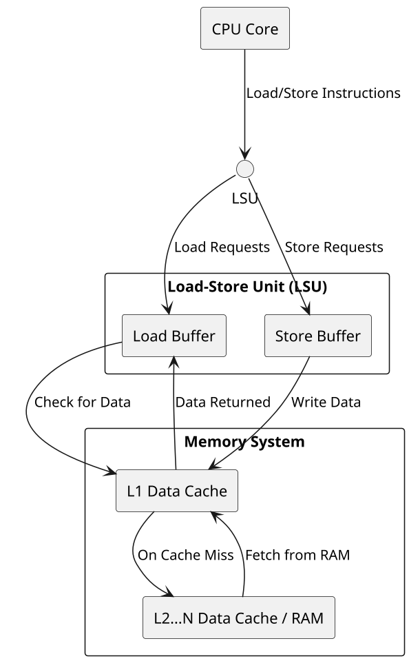

# **Overview of the Load-Store Unit (LSU)**  
The **Load-Store Unit (LSU)** is a core component that manages memory access in the CPU.
It handles the **loading** of data from memory into registers and **storing** of data back to memory, which directly impacts performance.



## **Responsibilities of the LSU Relevant to Developers**
While the LSU operates at a low level, developers can optimize performance by understanding how it works:

### ** Decoding Load/Store Instructions** 
   - The LSU identifies whether an instruction is a **load** (memory read) or a **store** (memory write), which affects how efficiently data is handled by the CPU. 
   - Developers can optimize by minimizing unnecessary memory accesses and ensuring data locality, reducing costly cache misses.

### ** Handling Memory Access Latency & Speculation**
   - When data is **not found** in the cache (cache miss), the LSU may **speculatively prefetch** the data to minimize memory access delay. 
   - **Out-of-Order Execution (OoOE)** allows the CPU to continue executing other instructions while waiting for memory, which can be leveraged to ensure your program remains efficient while waiting on memory-heavy operations. 
   - **Tip**: You can optimize by grouping related memory accesses together to exploit prefetching and minimize cache misses.


#### Speculative Prefetching (Hiding Latency by Predicting Future Loads)**  
##### **Problem:**  
If memory loads cause stalls, can the CPU **predict** and **preload data before it's needed**?  

##### **Solution:**  
The CPU uses **speculative prefetching** to predict future memory accesses and fetch data **before the program explicitly requests it**.  

##### **How It Works:**  
1. The CPU **monitors past memory accesses** to detect patterns (e.g., **sequential access**).  
2. If a pattern is detected, it **speculatively fetches** the next block of data **into the cache** before the instruction requests it.  
3. If the speculation is correct, the load completes **instantly** (cache hit).  

##### **Example (Prefetching in Action):**
```cpp
#include <iostream>
volatile int arr[100];

int main() {
    for (int i = 0; i < 100; i++) {
        arr[i] = i * 2; // CPU speculatively prefetches future elements
    }
    return 0;
}
```
- The CPU detects a **sequential memory access pattern**.  
- It **prefetches future `arr[i]` elements** into the cache before they are needed.  
- This **hides memory latency** by making future accesses **instantaneous** (cache hits).  

##### **Why Do We Need Explicit Prefetch (`__builtin_prefetch`)?**  
While speculative prefetching **works well for contiguous memory**, it **fails** in:  
- **Non-contiguous memory accesses** (e.g., linked lists, hash tables).  
- **Complex access patterns** where the CPU **can't predict the next access**.  

**In such cases, developers should use `__builtin_prefetch()` to manually trigger prefetching**:  
```cpp
#include <xmmintrin.h>  // Required for __builtin_prefetch
volatile int arr[100];

int main() {
    for (int i = 0; i < 100; i += 10) {
        __builtin_prefetch(&arr[i + 10], 0, 1);  // Prefetch next block
        arr[i] = i * 2;
    }
    return 0;
}
```
- The developer **manually hints** which memory block should be prefetched.  
- Works well for **irregular** access patterns where the CPU can't predict the next access.  


*NOTE**:
- Prefetching happens at the cache level, not the load buffer.
- The LSU interacts with prefetching by issuing loads that may or may not hit a prefetched cache line.
- Load buffers hold outstanding loads, but they do not predict future memory accesses like a prefetcher.


### ** Managing Load Buffers and Store Buffers**
   - **Load Buffer** and **Store Buffer** hold pending memory operations, enabling the CPU to manage delays without stalling.
   - By minimizing memory dependencies (i.e., ensuring that memory accesses don’t block each other unnecessarily), you can avoid pipeline stalls and make your program run faster.
   - **Tip**: Be mindful of memory access patterns to avoid unintentional memory access delays (e.g., frequent random memory access instead of sequential).

### ** Memory Consistency (Especially in Multi-Core CPUs)** 
   - The LSU ensures that data remains consistent across different cores, which is critical in multi-core applications.
   - Developers can optimize by using **memory barriers**  and ensuring proper synchronization when dealing with shared memory in parallel applications.
   - **Tip**: Proper use of locks and synchronization mechanisms can help maintain memory consistency, avoiding subtle bugs that might arise from improper handling of shared data.


