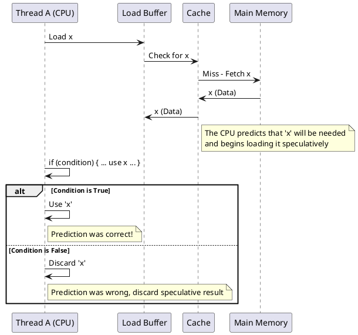
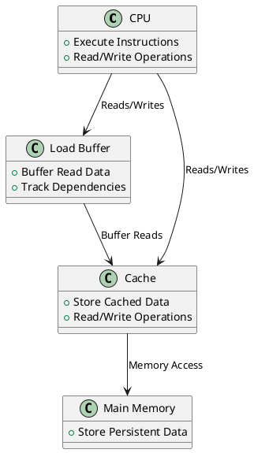
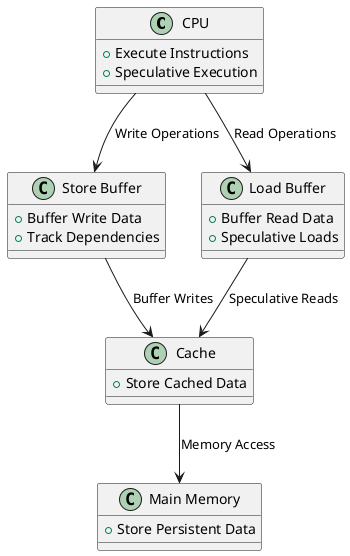
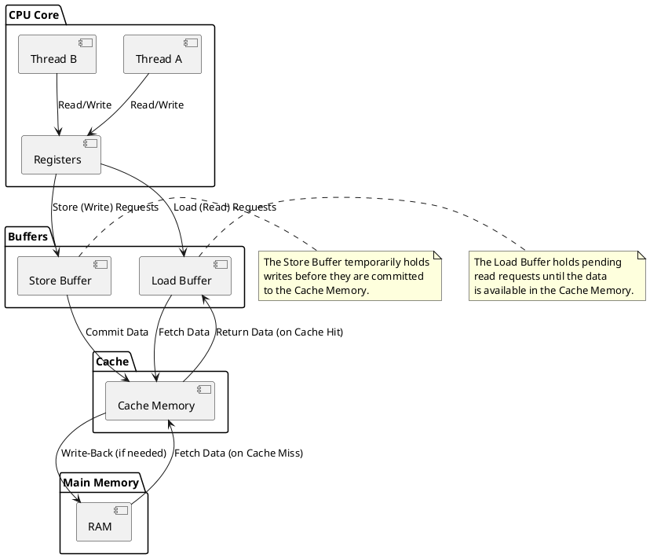
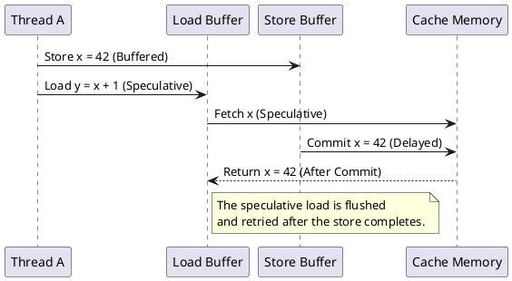
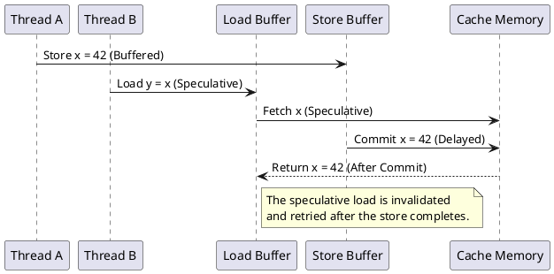

# Load and Store Buffers
### **Understanding Write Buffering in a Non-Coherent Shared Cache**
1. **CPU Write Path:**
   - When a thread writes to memory, the CPU **does not** always update the cache/memory immediately.
   - Instead, the data may first go into a **store buffer (write buffer)** inside the CPU.
   - This buffer temporarily holds the write before it gets committed to the L1 cache.
   - This delay causes another thread reading the same memory location to observe stale data, as the update isn't immediately visible in the cache.

2. **CPU Read Path:**
   - If a thread reads from memory, it checks the **L1 cache** first.
   - If the latest value is still in the store buffer (and not yet written to L1 cache), the thread may get an older value from the cache instead.

3. **Why Buffering Happens?**
   - To improve performance, CPUs use **write buffers** to avoid stalling the pipeline while waiting for the memory subsystem.
   - In a **non-coherent** cache system, these write buffers do not automatically synchronize across threads.

---

### **Block Diagram Using PlantUML**
Below is a **PlantUML block diagram** that shows:
- The CPU cores
- The Write Buffer
- The Shared Cache (L1 in this case)
- The read/write flow

I'll generate the PlantUML diagram now.

This diagram shows:
- **Thread A writes `X = 42`**, but it first enters the **Write Buffer**.
- The **Write Buffer** eventually updates **L1 Cache**.
- Meanwhile, **Thread B reads `X`** from L1 Cache, but if the write is still in the buffer, it may see an **old value**.

This is why **stale reads** occur in a non-coherent cache. Let me know if you need further modifications!


### **Size of the Store Buffer & Difference from CPU Registers**
1. **Size of the Store Buffer**  
   - The **store buffer** size depends on the CPU architecture.
   - Typically, it holds **a few to a few dozen entries** (e.g., Intel CPUs often have **42-56 store buffer entries** per core, AMD may vary).
   - Each entry usually holds a **memory address + data** until the write is committed to cache or main memory.
   - The exact size varies across architectures and microarchitectures.

2. **Difference Between Store Buffer and CPU Registers**
   | Feature         | **Store Buffer** | **CPU Registers** |
   |---------------|-----------------|-----------------|
   | **Purpose**    | Holds pending memory writes before committing to cache | Holds operands for computation, instruction execution |
   | **Visibility** | Invisible to software, managed internally by CPU | Directly accessible by instructions (e.g., `mov eax, ebx`) |
   | **Size**       | A few dozen entries per core | Fixed number (e.g., x86-64 has 16 general-purpose registers) |
   | **Lifespan**   | Temporary, entries retire after flushing to memory | Persistent until modified by an instruction |
   | **Access Speed** | Faster than memory but slower than registers | Fastest access (directly in CPU execution units) |
   | **Physical Location** | Inside CPU core, near execution units | Inside CPU core, tightly integrated with execution units |

3. **Is the Store Buffer Physically Part of the CPU?**
   - Yes, the store buffer is physically **inside the CPU core**, just like registers.
   - It is part of the **memory ordering machinery** and sits between the **execution units and the L1 cache**.
   - It operates at **different levels of visibility** than registers:
     - Registers are directly accessible and manipulated by instructions.
     - The store buffer is **transparent to software** and exists only to optimize memory operations.

Let me know if you want a block diagram explaining how the store buffer fits inside the CPU!


Okay, let's dive into load buffers, speculative execution, and memory disambiguation in a single-core, multi-threaded architecture.

**1. Load Buffer Block Diagram**

```plantuml
@startuml
!theme minty

box "CPU Core" {
  participant "Registers" as Registers
  participant "ALU" as ALU
  participant "Load Buffer" as LoadBuffer {
    participant "Entry 1" as LB1
    participant "Entry 2" as LB2
    participant "..." as LBdots
  }
}

box "Cache (Shared)" {
  participant "Cache Controller" as CacheController
  participant "Cache Memory" as CacheMemory
}

participant "Main Memory" as MainMemory

Registers -> ALU : Data for Operation
ALU -> Registers : Result

Registers -> LoadBuffer : Load Request (Address)
LoadBuffer -> CacheController : Read Request (Address)

CacheController -> CacheMemory : Check Cache (Tag Lookup)

alt Cache Hit
    CacheMemory -> CacheController : Data
    CacheController -> LoadBuffer : Data
    LoadBuffer -> Registers : Data
else Cache Miss
    CacheController -> MainMemory : Read Request (Address)
    MainMemory -> CacheController : Data
    CacheMemory -> CacheController : Store Data
    CacheController -> LoadBuffer : Data
    LoadBuffer -> Registers : Data
end

note left of Registers: Thread A or Thread B
note right of LoadBuffer: Load requests are buffered
note right of LoadBuffer: Speculative Execution & Memory Disambiguation

@enduml
```

**Explanation of the Load Buffer Diagram:**

*   **CPU Core:**
    *   **Registers:** As before, used to hold operands and results.
    *   **ALU:** Performs operations.
    *   **Load Buffer:** This is the *new* component we're focusing on. It's a queue that temporarily holds load (read) requests.

*   **Shared Cache and Main Memory:** Same as before.

*   **The Flow:**
    1.  The CPU needs data at a specific address.
    2.  The CPU places a load request (address) into the Load Buffer.
    3.  The Load Buffer sends a read request to the Cache Controller.
    4.  The Cache Controller checks the cache (hit or miss).
    5.  The data (from cache or main memory) is retrieved and placed *back* into the Load Buffer.
    6.  Finally, the data is sent from the Load Buffer to the Registers, where the CPU can use it.

**2. Speculative Execution and Memory Disambiguation Explained**

Let's break down speculative execution and memory disambiguation with examples.

**a) Speculative Execution**

*   **What it is:** The CPU tries to predict what instructions will be needed in the future and executes them *before* it's certain they are actually needed. This can significantly improve performance. In the context of memory accesses, this means the CPU might load data into the registers *before* it knows for sure that it's the correct data to load.
*   **Why it's useful:** Hides memory latency. Waiting for data from the cache or main memory is slow. By starting the load operation early, the CPU can potentially have the data ready when it's needed.

*   **The Problem:** The prediction might be wrong.

*   **Diagram and Example (Single-Core):**



*   **Real-World Example:**
    *   Consider the code:

    ```c++
    if (condition) {
        y = x + 5;
    } else {
        z = 10;
    }
    ```

    *   The CPU might *speculatively* load `x` into a register, even before it knows whether `condition` is true or false. If `condition` turns out to be true, the CPU has saved time because `x` is already loaded. If `condition` is false, the CPU simply discards the loaded value of `x`.

**b) Memory Disambiguation**

*   **What it is:** The CPU tracks dependencies between load (read) and store (write) operations that target the *same* memory location. This is important because if a store is buffered, the CPU needs to ensure that subsequent loads from the same location get the *updated* value, not a stale value.
*   **Why it's necessary:** Store buffers cause a delay in visibility . The CPU needs a mechanism to detect when a load might be reading the wrong data because a store to the same address is still pending in the buffer.
*   **The Problem:** If a store hasn't completed, loads that depend on that store could get the wrong value.

*   **Diagram and Example (Single-Core):**

```plantuml
@startuml
participant "Thread A (CPU)" as A
participant "Load Buffer" as LB
participant "Store Buffer" as SB
participant "Cache" as Cache

A -> SB : Store x = value
A -> LB : Load x

note over A, LB, SB, Cache : The CPU doesn't yet know\nif the load and store refer\nto the same address

alt Load and Store DO refer to same address
  A -> LB : Invalidate Load, Retry
  note right of LB: Memory Disambiguation: Load\nneeds to be retried after the\nstore completes to guarantee correctness
else Load and Store DO NOT refer to same address
  A -> A : Continue execution
  note right of A: Load and Store are independent
end
@enduml
```

*   **Real-World Example:**

```c++
x = 10;  // Store operation
y = x + 5; // Load operation
```

*   The compiler knows there is a dependency because the load from X is dependendnt on store to x, and the CPU might try to execute the load of `x` before the store of `10` to `x` is complete.
*   **Memory Disambiguation in Action:**
    1.  **Store `x = 10` in Store Buffer:** The `store x = 10` instruction is placed in the store buffer.
    2.  **Load `x` in Load Buffer:** The `load x` instruction is placed in the load buffer.
    3.  **Address Comparison:** The CPU compares the address of the load in the load buffer with the address of the store in the store buffer. If it detects that they are the same address, it knows there's a potential dependency.
    4.  **Stall or Invalidate and Retry:** To guarantee correctness, the CPU might:
        *   **Stall:** Pause the execution of the `load x` instruction until the `store x = 10` completes.
        *   **Invalidate and Retry:** Allow the `load x` to complete speculatively, but if the `store x = 10` completes later and changes the value of `x`, the CPU will invalidate the speculatively loaded value and retry the `load x` instruction.

**Key Points:**

*   **Single-Core Relevance:** Speculative execution and memory disambiguation are important optimizations even on single-core systems.
*   **The Load Buffer's Role:** The load buffer is a key component for managing these optimizations. It allows the CPU to track load requests and their dependencies.
*   **Memory Barriers:** Memory barriers can be used to enforce ordering constraints and prevent speculative execution in certain situations.

The load buffer, speculative execution, and memory disambiguation are complex but crucial techniques that CPUs use to improve performance. They require careful management to ensure that memory operations are performed correctly, especially in multi-threaded environments.


Got it! Let's tackle these one by one.

### 1. Block Diagram for Load Buffer

Here’s a block diagram similar to the one for the Store Buffer, but focusing on the Load Buffer and how it interacts with the CPU core, cache, and memory in a multithreaded architecture:



### 2. Speculative Execution and Memory Disambiguation

#### Speculative Execution

Speculative execution is an optimization technique used by modern CPUs to improve performance. Here’s how it works:

1. **Speculative Load:** If a load (read) operation depends on a store (write) that hasn't completed yet, the CPU might speculatively execute the load. This means the CPU makes an educated guess and proceeds with the read operation.

2. **Flush and Retry:** If the speculation is incorrect (for example, the guessed value turns out to be wrong due to store buffer dependencies), the CPU must flush the speculatively executed instructions and retry the correct load.

**Real-World Example:**

Consider a scenario where a program is reading a configuration setting right after writing to it:
- Thread A writes a configuration value.
- Thread B reads the configuration value.
- If Thread B's read operation is speculatively executed before Thread A's write completes, the CPU might read an incorrect value. If the speculation is wrong, the CPU must invalidate the read and retry.

#### Memory Disambiguation

Memory disambiguation helps the CPU keep track of dependencies between loads and stores, ensuring correct execution:

1. **Tracking Dependencies:** If a load and a store target the same address, but the CPU doesn’t know it yet, the load buffer helps track these dependencies. The load buffer temporarily holds the load data until the dependencies are resolved.

2. **Invalidation and Retry:** If a store to the same address completes later, the CPU may need to invalidate the speculative load and retry it with the correct data.

**Real-World Example:**

Consider a database application that updates and reads records:
- Thread A updates a record (store operation).
- Thread B reads the same record (load operation).
- If the CPU speculatively executes the read before the update completes, the load buffer tracks this dependency.
- Once the update completes, if the read is found to be incorrect, the CPU invalidates the read and retries with the updated data.

### PlantUML Diagram for Speculative Execution and Memory Disambiguation

Here's a diagram to illustrate speculative execution and memory disambiguation:



I hope this provides a clearer picture of how these mechanisms work! If you have any more questions or need further explanations, feel free to ask.


Got it! Let’s focus on a **single-core machine** with a **multi-threaded architecture** and dive into the concepts of **load buffers**, **store buffers**, **speculative execution**, and **memory disambiguation**. I’ll provide detailed explanations, real-world examples, and PlantUML diagrams to illustrate these concepts.

---

### **1. Block Diagram of Load Buffer and Store Buffer**

In a single-core machine, the CPU uses **load buffers** and **store buffers** to manage memory operations efficiently. These buffers act as temporary storage for memory requests, allowing the CPU to continue executing instructions while waiting for memory accesses to complete.

Here’s the block diagram showing the **load buffer**, **store buffer**, and the flow of data between the CPU core, cache, and memory:



---

### **Key Components in the Diagram**

1. **CPU Core**:  
   - Contains **Thread A** and **Thread B**, which execute instructions independently.  
   - Each thread has its own set of **registers** for temporary storage.

2. **Load Buffer**:  
   - Temporarily holds **read requests** (loads) until the data is available in the cache.  
   - Ensures that the CPU can continue executing instructions while waiting for memory reads to complete.

3. **Store Buffer**:  
   - Temporarily holds **write requests** (stores) before they are committed to the cache.  
   - Allows the CPU to continue executing instructions without waiting for writes to complete.

4. **Cache Memory**:  
   - A shared cache that stores frequently accessed data.  
   - Divided into **cache lines**, which are the smallest units of data transfer between the cache and main memory.

5. **Main Memory (RAM)**:  
   - Slower, larger storage that holds all data.  
   - The cache memory acts as a faster intermediary between the CPU and main memory.

---

### **2. Speculative Execution and Memory Disambiguation**

#### **Speculative Execution**

Speculative execution is a technique used by modern CPUs to improve performance by executing instructions **before knowing whether they are actually needed**. This is particularly useful for **loads** (reads) that depend on **stores** (writes) that haven’t completed yet.

##### **How It Works**
1. The CPU encounters a **load** instruction that depends on a **store** instruction (e.g., the load reads from a memory location that the store is writing to).  
2. The CPU **speculatively executes** the load, assuming that the store will not affect the load.  
3. If the assumption is correct, the result of the load is used.  
4. If the assumption is wrong (e.g., the store modifies the same memory location), the CPU must **flush** the speculative execution and **retry** the load.

##### **Real-World Example**
```cpp
int x = 0;
int y = 0;

void threadA() {
    x = 42; // Store
    y = x + 1; // Load depends on the store
}

void threadB() {
    if (y == 43) {
        // Do something
    }
}
```

- The CPU speculatively executes the load `y = x + 1` before the store `x = 42` completes.  
- If the store `x = 42` modifies the value of `x`, the CPU must flush and retry the load.

##### **PlantUML Diagram**


---

#### **Memory Disambiguation**

Memory disambiguation is a technique used by the CPU to resolve dependencies between **loads** and **stores** that target the same memory location. The CPU uses the **load buffer** and **store buffer** to track these dependencies and ensure correct execution.

##### **How It Works**
1. The CPU encounters a **load** and a **store** that target the same memory location.  
2. The CPU does not initially know whether the load depends on the store.  
3. The **load buffer** and **store buffer** track the addresses of pending loads and stores.  
4. If a store to the same address later completes, the CPU may need to **invalidate** the load and **retry** it.

##### **Real-World Example**
```cpp
int x = 0;

void threadA() {
    x = 42; // Store
}

void threadB() {
    int y = x; // Load
}
```

- The CPU speculatively executes the load `y = x` before the store `x = 42` completes.  
- If the store `x = 42` modifies the value of `x`, the CPU must invalidate and retry the load.

##### **PlantUML Diagram**


---

### **Key Takeaways**

1. **Load Buffer**:  
   - Temporarily holds **read requests** until the data is available in the cache.  
   - Helps manage speculative execution and memory disambiguation.

2. **Store Buffer**:  
   - Temporarily holds **write requests** before they are committed to the cache.  
   - Allows the CPU to continue executing instructions without waiting for writes to complete.

3. **Speculative Execution**:  
   - The CPU executes instructions speculatively to improve performance.  
   - If the speculation is wrong, the CPU must flush and retry the execution.

4. **Memory Disambiguation**:  
   - The CPU resolves dependencies between loads and stores using the load buffer and store buffer.  
   - If a store modifies a memory location that a load depends on, the CPU must invalidate and retry the load.

---

This explanation and diagrams should help you understand the **load buffer**, **store buffer**, **speculative execution**, and **memory disambiguation** in a single-core, multi-threaded system. Let me know if you need further clarification! 😊


Let's isolate the cache coherence (or rather, *lack* of coherence) issues in a single-core, multi-threaded system where the cache is shared. This scenario is somewhat artificial because, in practice, modern single-core systems typically *do* have some level of cache coherence mechanisms, but let's assume a hypothetical system where the cache acts as a simple, shared storage without any coherence protocols. Also, as requested, we are ignoring reordering issues.

Here's a breakdown of the data visibility issues:

1.  **Stale Reads (Thread A Writes, Thread B Reads Stale Data):**
    *   **Scenario:** Thread A writes to a memory location. The value is updated in the shared cache. Later, Thread B reads from the same memory location. *However*, due to internal cache operations, Thread B might still read a *stale* value from the cache. There's no guarantee that the updated value written by Thread A will be immediately visible to Thread B.
    *   **Cause:** The delay is because Thread A's write might be buffered within the cache before actually updating the cache line. In a non-coherent cache, there is nothing that ensures Thread B will see that update when the cache line has been updated.

2.  **Lost Updates (Thread A and Thread B Both Modify Data):**
    *   **Scenario:** Thread A reads a value from the shared cache, modifies it, and writes it back. Thread B *also* reads the same value from the shared cache, modifies it, and writes it back. If Thread B's write happens after Thread A's write, Thread A's update will be lost.
    *   **Cause:** Without cache coherence or explicit synchronization, there's no mechanism to prevent multiple threads from simultaneously operating on the same data.

3.  **Visibility Delays (A Writes, B Doesn't See Update Immediately):**
    *   **Scenario:** Thread A writes to a memory location. Thread B attempts to read from that same location "soon" after Thread A's write. Thread B might read the old value because there's a delay before the update is visible in the shared cache.
    *   **Cause:** The update written by A might be in a write buffer in the cache and not immediately visible to other threads.

4.  **Locking and Synchronization Problems:**
    *   **Scenario:** If multiple threads attempt to acquire a lock variable (e.g., a spinlock) without a proper synchronization mechanism, multiple threads could enter a critical section simultaneously.
    *   **Cause:** A thread may see a stale version of the lock variable, leading it to falsely believe it can enter the critical section.

5.  **Incorrect Data Sharing:** If threads communicate by writing data into shared data structures (e.g., message queues), without proper cache coherence and synch, inconsistent values may appear to other threads.

**Important Considerations**

*   **Cache Line Granularity:** The "unit" of sharing and potential staleness is the cache line, not individual bytes.
*   **Lack of Atomicity:** These problems are closely related to the lack of atomicity. Without synchronization, multiple threads can be executing operations simultaneously, thus resulting in visibility issues.

**Single-Core vs. Multi-Core:**

Even in this hypothetical single-core system, these cache-related issues are significant.

*   **Correctness is Affected:** The results of the program will be unpredictable.
*   **Synchronization Becomes Crucial:** Proper synchronization primitives, such as mutexes, semaphores, and critical sections, are necessary to prevent these issues.

These issues illustrate the need for proper synchronization primitives to ensure correct multi-threaded execution, even in the absence of multiple cores. The presence of cache coherence protocols would alleviate some of these issues, but the fundamental need for synchronization remains.
