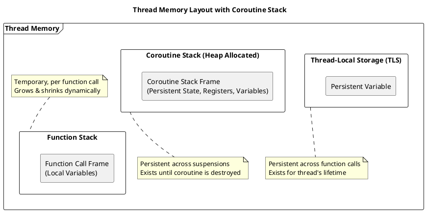
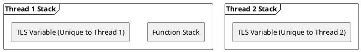
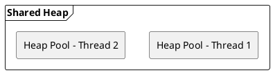

# Understanding Stack, Thread-Local Storage, and Coroutine Stack in C++

## Introduction
In modern C++ programming, understanding stack behavior is crucial for efficient memory management, especially when dealing with multithreading and coroutines.
This article explores stack, thread-local storage (TLS), and coroutine stacks in detail, covering their storage mechanisms, behavior, and sharing properties.

---

<!--

-->


## 1. Function Stack vs. Thread-Local Storage (TLS)
### Function Stack:
- Every function call creates a **stack frame**.
- Stack frames are **local** to the thread executing the function.
- When the function returns, its stack frame is destroyed automatically.

**Example:**
```cpp
void foo() {
    int x = 42; // x is stored in the function stack
}
```
When `foo()` is called, `x` is allocated on the function stack. Once `foo()` returns, `x` is destroyed.

### Thread-Local Storage (TLS):
- A variable declared as `thread_local` is unique to each thread.
- The storage persists across function calls within the same thread.

**Example:**
```cpp
thread_local int tls_var = 10; // Each thread gets its own copy

void modify_tls() {
    tls_var++; // Affects only the current thread's tls_var
}
```
Each thread gets a separate instance of `tls_var`, ensuring no data races.

<!--

-->

---

## 2. Heap Allocation and Thread-Specific Pools


### Heap Behavior:
- The **heap is shared** among all threads, but each allocation (`new`) creates an independent block.
- Memory allocators optimize heap usage by maintaining **thread-specific pools**, reducing contention.

**Example:**
```cpp
void worker() {
    int* heap_var = new int(5); // Allocated on heap, but managed per thread
}
```
Each thread calling `worker()` gets its **own independent heap allocation**.
<!--

-->


---

## 3. Coroutine Stack
### Differences from Function Stack:
- A function stack **grows and shrinks** with function calls.
- A coroutine stack **persists** even when suspended.
- Coroutine stack frames are **allocated on the heap** to allow state retention across suspensions.

**Example Coroutine:**
```cpp
#include <iostream>
#include <coroutine>

struct MyCoroutine {
    struct promise_type {
        MyCoroutine get_return_object() { return {}; }
        std::suspend_always initial_suspend() { return {}; }
        std::suspend_always final_suspend() noexcept { return {}; }
        void return_void() {}
        void unhandled_exception() {}
    };
};

MyCoroutine example() {
    std::cout << "Hello" << std::endl;
    co_await std::suspend_always{};  // Coroutine suspends here
    std::cout << "World" << std::endl;
}
```
### Walkthrough:
1. `example()` is called, printing **"Hello"**.
2. Coroutine **suspends** at `co_await std::suspend_always{}`.
3. When resumed, it prints **"World"** and exits.
4. The coroutine stack frame is **explicitly destroyed** after execution.

**Why Heap Allocation?**
- Unlike function calls, coroutines **persist their state**, so their stack **cannot be deallocated immediately**.
- Using the heap allows coroutines to be resumed later from different threads.

---

## Conclusion
| Feature            | Function Stack         | Thread-Local Storage | Coroutine Stack                    |
|--------------------|------------------------|----------------------|------------------------------------|
| **Scope**          | Local to function      | Local to thread      | Local to coroutine                 |
| **Lifetime**       | Until function returns | Until thread exits   | Until coroutine completes          |
| **Storage**        | Stack                  | Stack/Static         | Heap                               |
| **Thread Sharing** | No                     | No                   | Yes (if resumed by another thread) |

This comprehensive understanding of stack, TLS, and coroutine stack will help you optimize memory management in multithreaded C++ applications.

