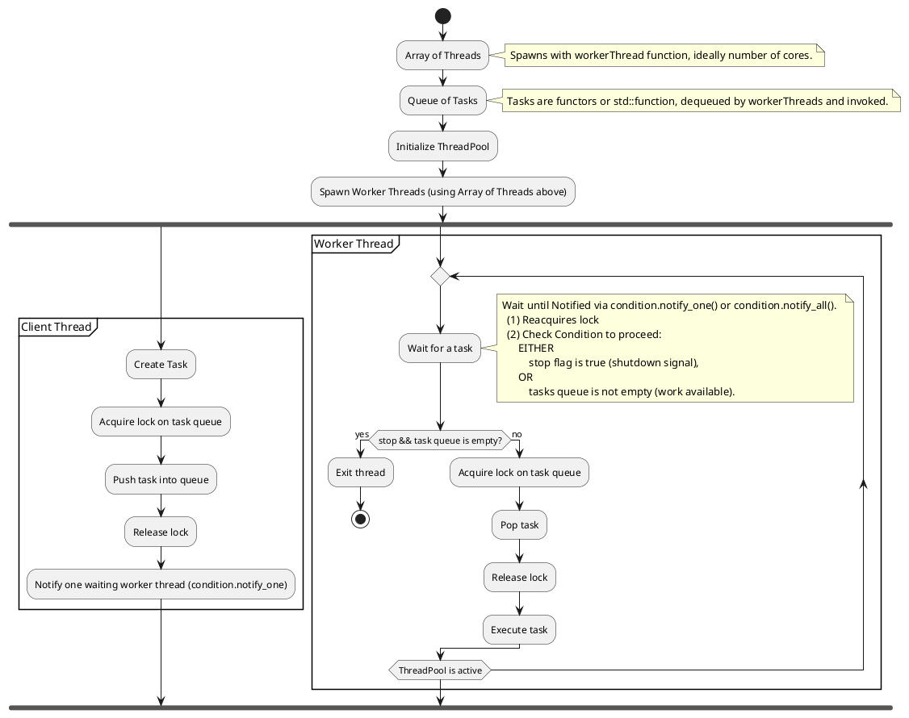

### **Design of a Basic Thread Pool**  

A **Thread Pool** is a system where a fixed number of worker threads handle tasks from a queue, avoiding the overhead of frequently creating and destroying threads.

---

### **Components of a Thread Pool**

1. **Worker Threads:** A fixed number of threads that continuously execute tasks from the queue.
2. **Task Queue:** A queue that holds tasks waiting to be executed.
3. **Task Submission Interface:** A function to add tasks to the queue.
4. **Synchronization Mechanism:** A mutex and condition variable to coordinate thread access to the queue.
5. **Shutdown Mechanism:** A way to gracefully shut down the thread pool.  

---

### **Basic Implementation**

#### **1. Data Members of the Thread Pool**
- `std::vector<std::thread>` → Stores worker threads.
- `std::queue<std::function<void()>>` → Stores tasks to be executed.
- `std::mutex` → Synchronizes access to the queue.
- `std::condition_variable` → Notifies worker threads about new tasks.
- `bool stop` → A flag to stop the thread pool.  

#### **2. Working of the Thread Pool**
- A fixed number of worker threads are created.
- Each worker waits for tasks in a loop.
- When a task is available, a worker thread picks it up and executes it.
- If no tasks are available, the thread waits.
- When the thread pool is destroyed, all threads stop gracefully.  

---

<!--

-->


### **Code Implementation in C++**
```cpp
#include <iostream>
#include <vector>
#include <queue>
#include <thread>
#include <mutex>
#include <condition_variable>
#include <functional>

class ThreadPool {
public:
    ThreadPool(size_t numThreads);
    ~ThreadPool();

    void enqueueTask(std::function<void()> task);

private:
    std::vector<std::thread> workers;
    std::queue<std::function<void()>> tasks;

    std::mutex queueMutex;
    std::condition_variable condition;
    bool stop;

    void workerThread();
};

ThreadPool::ThreadPool(size_t numThreads) : stop(false) {
    for (size_t i = 0; i < numThreads; ++i) {
        workers.emplace_back([this] { workerThread(); });
    }
}

ThreadPool::~ThreadPool() {
    {
        std::unique_lock<std::mutex> lock(queueMutex);
        stop = true;
    }
    condition.notify_all();
    for (std::thread &worker : workers) {
        worker.join();
    }
}

void ThreadPool::enqueueTask(std::function<void()> task) {
    {
        std::unique_lock<std::mutex> lock(queueMutex);
        tasks.push(std::move(task));
    }
    condition.notify_one();
}

void ThreadPool::workerThread() {
    while (true) {
        std::function<void()> task;
        {
            std::unique_lock<std::mutex> lock(queueMutex);
            condition.wait(lock, [this] { return stop || !tasks.empty(); });

            if (stop && tasks.empty())
                return;

            task = std::move(tasks.front());
            tasks.pop();
        }
        task();
    }
}

int main() {
    ThreadPool pool(4);

    for (int i = 0; i < 10; ++i) {
        pool.enqueueTask([i] {
            std::cout << "Executing task " << i << " in thread " 
                      << std::this_thread::get_id() << std::endl;
        });
    }

    std::this_thread::sleep_for(std::chrono::seconds(2));  // Simulate work
    return 0;
}
```

---

### **Explanation of the Implementation**
1. **Constructor (`ThreadPool::ThreadPool`)**
   - Initializes the thread pool with `numThreads`.
   - Each worker thread executes `workerThread()`. 

2. **Destructor (`ThreadPool::~ThreadPool`)**
   - Sets `stop = true`.
   - Notifies all worker threads.
   - Joins all worker threads before destruction.  

3. **Task Enqueue (`ThreadPool::enqueueTask`)**
   - Acquires a lock on `queueMutex`.
   - Pushes the task into the queue.
   - Notifies one worker thread.

4. **Worker Thread (`ThreadPool::workerThread`)**
   - Waits for a task (`condition.wait`).
   - Picks up a task and executes it.
   - Continues until `stop` is true and the queue is empty.

---

### **Advantages of This Design**
 **Efficient Thread Management:** Reuses worer threads instead of creating and destroying them.
 **Reduced Latency:** Tasks are executed as soon as threads are available.
 **Concurrency Control:** Uses `std::mutex` and `std::condition_variable` for safe queue access.

---

### **Next Steps**
This is a basic thread pool. You can extend it by:
- **Dynamic Thread Management:** Adjust the number of worker threads at runtime.
- **Task Prioritization:** Use a priority queue for high-priority tasks.
- **Exception Handling:** Wrap tasks in a `try-catch` block to handle errors.  

Would you like to explore a Rust implementation of this? 
