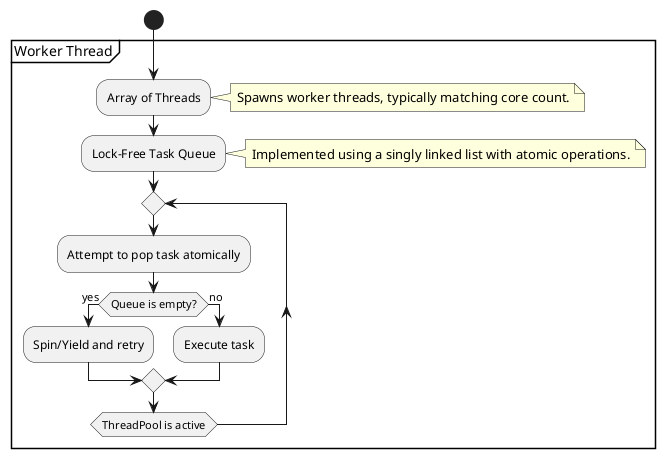

A **Lock-Free Thread Pool** eliminates the use of traditional synchronization primitives like mutexes and condition variables.
Instead, it relies on **lock-free data structures** (like a concurrent queue) and **atomic operations** to reduce contention and improve performance in multi-threaded environments.


Here's a **concise and clear** PlantUML activity diagram for a **Lock-Free Thread Pool**, following the style of your provided example:  




Glad you liked it! Here’s the **extended version** with **atomic operations** clearly explained:  

---

### **🔹 Lock-Free Queue (Step-by-Step with Atomic Operations)**

#### **1️⃣ Initialization**
- Create a **dummy node** as a placeholder.  
- Both **head** (for dequeue) and **tail** (for enqueue) **start** at this dummy node.  
- Both `head` and `tail` are **atomic pointers** (so multiple threads can modify them safely).  

---

#### **2️⃣ Enqueue (Push)**
1. Create a **new node** with the given value.  
2. Read the **current tail**:  
   - If `tail.next` **is not null**, it means another thread already added a node.  
     - **Fix the tail by moving it forward**:  
       - **Atomic Compare-And-Swap (CAS)** updates `tail` to `tail.next`.  
       - Retry from step 2.  
   - Otherwise, **link the new node atomically**:  
     - Use **CAS to set `tail.next` to the new node** (ensuring only one thread succeeds).  
3. Move `tail` forward to the new node using **CAS**.  
4. If another thread updated `tail` first, retry.  

---

#### **3️⃣ Dequeue (Pop)**
1. Read the **current head**:  
   - If `head == tail` **and** `head.next == NULL`, the queue is **empty**. Return.  
   - Otherwise, read `head.next` (the first real value).  
2. Atomically **move `head` forward**:  
   - Use **CAS to update `head` to `head.next`**.  
   - If CAS fails (another thread already moved `head`), retry.  
3. Return the value of `head.next`.  
4. The old `head` node is discarded.  

---

### **🔹 Atomic Operations Summary**
| **Operation** | **Atomic Mechanism Used** |
|--------------|-------------------------|
| Enqueue (Push) | `CAS(tail.next, NULL, new_node)` → Ensures only one thread links the new node. |
| Move Tail Forward | `CAS(tail, last, new_node)` → Ensures only one thread moves `tail`. |
| Dequeue (Pop) | `CAS(head, first, next)` → Ensures only one thread advances `head`. |

---

### **🔹 Why This Works?**
- **Lock-Free**: No waiting, only atomic updates (CAS ensures correctness).  
- **Multiple Threads**: Enqueue and dequeue **can run in parallel** without blocking.  
- **Retries Handle Contention**: If a CAS fails (another thread updated first), retry until successful.  

Would you like a **real C++ implementation** next? 🚀


### **🔹 Key Differences from Mutex-Based Thread Pool**
- **No Mutex & Condition Variable** → Instead, **lock-free atomic operations** (like CAS) are used for task retrieval.
- **Spin/Yield Instead of Blocking** → If the queue is empty, the worker **spins or yields** instead of waiting on a condition variable.

Would you like a **C++ implementation** based on this design? 


---

## **Lock-Free Thread Pool: Key Concepts**
### **Key Components**
1. **Fixed Thread Pool** – A fixed number of worker threads continuously process tasks.
2. **Lock-Free Work Queue** – Uses a **lock-free queue** (e.g., `std::atomic`-based concurrent queue).
3. **Task Submission** – Tasks are pushed into the queue without locks.
4. **Worker Execution** – Threads keep pulling tasks from the queue in a non-blocking manner.
5. **Shutdown Mechanism** – Uses atomics to signal termination.

### **Why Lock-Free?**
- Eliminates **mutex contention**, improving performance.
- Reduces **context switching overhead**.
- Useful for **high-throughput, low-latency** applications (e.g., game engines, real-time systems).

---

## **Implementation: Lock-Free Thread Pool in C++**
Here’s a minimal lock-free thread pool using **`std::atomic` and `std::unique_ptr`** for the queue:

### **Step 1: Implement a Lock-Free Queue**
We'll use **Michael-Scott lock-free queue** (a widely used concurrent queue algorithm):

```cpp
#include <atomic>
#include <memory>

template<typename T>
class LockFreeQueue {
private:
    struct Node {
        std::unique_ptr<T> data;
        std::atomic<Node*> next;

        Node(T* val = nullptr) : data(val), next(nullptr) {}
    };

    std::atomic<Node*> head;
    std::atomic<Node*> tail;

public:
    LockFreeQueue() {
        Node* dummy = new Node();
        head.store(dummy);
        tail.store(dummy);
    }

    ~LockFreeQueue() {
        while (Node* old_head = head.load()) {
            head.store(old_head->next);
            delete old_head;
        }
    }

    void push(T val) {
        Node* new_node = new Node(new T(val));
        Node* old_tail = nullptr;

        while (true) {
            old_tail = tail.load();
            Node* expected = nullptr;
            if (old_tail->next.compare_exchange_weak(expected, new_node)) {
                tail.compare_exchange_strong(old_tail, new_node);
                return;
            }
        }
    }

    bool pop(T& result) {
        Node* old_head = nullptr;

        while (true) {
            old_head = head.load();
            Node* next_node = old_head->next.load();
            if (!next_node) return false;

            if (head.compare_exchange_weak(old_head, next_node)) {
                result = std::move(*next_node->data);
                delete old_head;
                return true;
            }
        }
    }
};
```

---

### **Step 2: Implement the Lock-Free Thread Pool**
```cpp
#include <vector>
#include <thread>
#include <functional>
#include <atomic>
#include <iostream>

class LockFreeThreadPool {
private:
    std::vector<std::thread> workers;
    LockFreeQueue<std::function<void()>> task_queue;
    std::atomic<bool> stop_flag;

public:
    explicit LockFreeThreadPool(size_t num_threads) : stop_flag(false) {
        for (size_t i = 0; i < num_threads; ++i) {
            workers.emplace_back([this] {
                while (!stop_flag.load()) {
                    std::function<void()> task;
                    if (task_queue.pop(task)) {
                        task();  // Execute task
                    }
                }
            });
        }
    }

    ~LockFreeThreadPool() {
        stop_flag.store(true);
        for (std::thread &worker : workers) {
            if (worker.joinable()) worker.join();
        }
    }

    void submit(std::function<void()> task) {
        task_queue.push(std::move(task));
    }
};

// Example Usage
int main() {
    LockFreeThreadPool pool(4);

    for (int i = 0; i < 10; ++i) {
        pool.submit([i] {
            std::cout << "Executing Task " << i << " on thread " 
                      << std::this_thread::get_id() << std::endl;
        });
    }

    std::this_thread::sleep_for(std::chrono::seconds(1));
    return 0;
}
```

---

## **💡 Walkthrough of the Code**
### **Lock-Free Queue**
- The queue is implemented using an **atomic linked list**.
- `push()` inserts tasks at the end without locking.
- `pop()` removes tasks from the front safely using atomic compare-exchange.

### **Lock-Free Thread Pool**
- A **vector of worker threads** continuously pulls tasks from the queue.
- A **lock-free task queue** ensures low-latency task insertion and retrieval.
- An **atomic stop flag** signals when to shut down.

### **Task Execution**
- Tasks are stored as `std::function<void()>`, allowing lambda functions.
- Threads keep executing tasks **asynchronously** without blocking.

---

## **Performance Benefits**
 **Low Overhead:** No locks, reducing context switches.  
 **Scalability:** Threads operate independently with minimal contention.  
 **Ideal for High-Throughput Scenarios:** Like game engines, networking, or parallel computations.

---

## ** Key Considerations**
🔹 **Memory Reclamation Issue:** Lock-free queues suffer from ABA problems. This can be fixed using hazard pointers or epoch-based memory reclamation.  
🔹 **Load Balancing:** Work-stealing can further improve efficiency.  
🔹 **Task Prioritization:** Lock-free priority queues are harder to implement.  

Would you like to explore **work-stealing** or **prioritization** in a lock-free setting?


Yes, in a **lock-free thread pool**, **only the task queue is lock-free**. However, if a **task itself accesses a shared resource**, you still need **explicit synchronization inside the task**.  

---

## **🔹 What is Synchronized?**
1. **The Thread Pool Itself (Worker Threads + Task Queue)**  
   - The **task queue** is **lock-free** (atomic operations, typically using CAS).  
   - Worker threads operate independently and do **not** block each other.

2. **The Individual Task Execution**  
   - **Not automatically synchronized.**  
   - If a task modifies a **shared resource (e.g., file, shared memory, database)**, it **must handle its own synchronization** (e.g., using `std::mutex`, atomic variables, etc.).

---

## **🔹 Example Cases**
### **✅ Case 1: Tasks Are Independent (No Synchronization Needed)**
If tasks **do not share state**, no explicit synchronization is required.  
Example:  
```cpp
void independentTask() {
    std::cout << "Task running independently\n";
}
```

---

### **❌ Case 2: Tasks Access Shared Resource (Explicit Synchronization Needed)**
If tasks access a **shared resource**, they must use **synchronization mechanisms**.  
Example:  
```cpp
std::mutex logMutex;  // Mutex to protect shared resource

void taskWithSharedResource() {
    std::lock_guard<std::mutex> lock(logMutex);  // Explicit synchronization
    std::cout << "Writing to shared resource\n";
}
```

Without this mutex, multiple threads could corrupt the shared resource.

---

## **🔹 Final Answer**
- **Lock-free thread pools** only ensure that **task scheduling** is lock-free.  
- **Tasks themselves** must handle synchronization if they modify shared state.  
- Use `std::mutex`, atomic variables, or other synchronization techniques **inside the task** when necessary.

Would you like to discuss **optimizing shared resource access** within lock-free designs? 🚀
