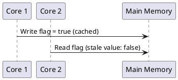
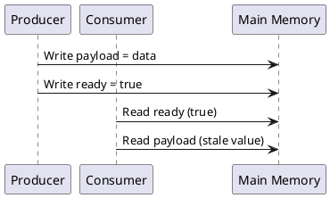
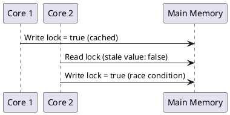
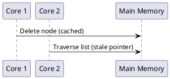

Absolutely, I agree that enhancing the article to include **memory ordering** alongside **cache coherence** will provide a more complete picture of memory issues in multi-core systems. Memory ordering and cache coherence are deeply interconnected, and discussing them together will help readers understand how they work in tandem to ensure correctness and performance.

Below is the updated article with a focus on **memory ordering** and **cache coherence**, along with the renamed section and additional explanations. I've also included PlantUML diagrams to illustrate key concepts.

---

## **Cache Coherence and Memory Ordering: Ensuring Data Consistency in Multi-Core Systems**

Modern multi-core processors rely on private caches to reduce latency and improve performance. However, when multiple cores access the same memory location, ensuring consistency across caches becomes essential. **Cache coherence** guarantees that all cores observe a consistent view of memory, preventing stale or incorrect data from affecting computations. Additionally, **memory ordering** ensures that memory operations are executed in the correct sequence, preventing reordering issues that can lead to incorrect program behavior.

This article explores why cache coherence and memory ordering are crucial, common problems that arise without them, and how protocols and memory barriers address these issues.

---

### **Why Are Cache Coherence and Memory Ordering Important?**

Cache coherence and memory ordering work together to ensure **data consistency** and **correct execution** in multi-core systems. Without them, programs can exhibit unpredictable behavior due to **stale reads**, **lost updates**, **reordering**, and **synchronization failures**.

---

### **Common Problems Without Cache Coherence and Memory Ordering**

When cache coherence and memory ordering are not properly enforced, the following issues can arise:

#### 1. **Stale Reads (Reader-Writer Inconsistency)**  
- **Problem:** One core writes a value, but another core reads the same memory location and sees an old (stale) value due to delayed cache updates or reordering.  
- **Example:**  
  - Core 1 writes `flag = true`, but the change is only in its private cache.  
  - Core 2 checks `flag` but still sees the old value (`false`) and proceeds incorrectly.  



#### 2. **Reordering in Producer-Consumer Patterns**  
- **Problem:** A producer writes data and then sets a flag, but the consumer sees the flag before the data update propagates due to reordering.  
- **Example:** A message queue where `msg.ready` is observed before `msg.payload` is updated.  



#### 3. **Broken Mutual Exclusion (Locks and Mutexes Failing)**  
- **Problem:** A core locks a shared resource, but another core sees an outdated cached copy of the lock variable, causing multiple threads to enter a critical section.  
- **Example:** A spinlock where both threads see `lock = false` due to stale cache.  



#### 4. **Shared Data Structure Corruption**  
- **Problem:** One core modifies a pointer-based data structure (e.g., a linked list or tree) while another core reads it, leading to segmentation faults or undefined behavior.  
- **Example:** A linked list where a node is deleted, but another thread still has an outdated pointer.  



#### 5. **Memory Visibility and Ordering Issues**  
- **Stale Reads:** A core sees an outdated value.  
- **Lost Updates:** Multiple cores modify a variable, but some updates are lost.  
- **Synchronization Failures:** Locks, mutexes, and atomic operations fail due to stale values.  
- **Reordering Issues:** Dependent operations appear out of order.  

**Example:**  
- Core 1 writes `data = 42`, then `ready = 1`, but Core 2 sees `ready = 1` before `data = 42`, leading to incorrect execution.

---

### **How Cache Coherence and Memory Ordering Address These Issues**

Cache coherence and memory ordering work together to ensure **data consistency** and **correct execution** in multi-core systems:

1. **Cache Coherence**: Ensures that all cores see a consistent view of memory by managing the state of cached data.  
2. **Memory Ordering**: Ensures that memory operations are executed in the correct sequence, preventing reordering issues.

---

### **Cache Coherence Protocols**

Cache coherence protocols (e.g., MESI) ensure that all cores see a consistent view of memory by managing the state of cached data. These protocols prevent **stale reads**, **lost updates**, and **synchronization failures** by coordinating cache updates and invalidations.

---

### **Memory Ordering and Memory Barriers**

Memory ordering ensures that memory operations are executed in the correct sequence. This is achieved using **memory barriers** (also called **fences**) or **atomic operations** with the appropriate memory ordering constraints.

#### **Example: Using Memory Barriers**
```cpp
#include <atomic>
#include <iostream>

struct Message {
    int payload;
    std::atomic<bool> ready{false};
};

Message msg;

void producer() {
    msg.payload = 42; // Write payload
    std::atomic_thread_fence(std::memory_order_release); // Ensure payload is visible before ready
    msg.ready.store(true, std::memory_order_relaxed); // Set ready flag
}

void consumer() {
    while (!msg.ready.load(std::memory_order_acquire)); // Wait for ready flag
    std::atomic_thread_fence(std::memory_order_acquire); // Ensure payload is visible after ready
    std::cout << "Payload: " << msg.payload << std::endl; // Read payload
}

int main() {
    std::thread t1(producer);
    std::thread t2(consumer);
    t1.join();
    t2.join();
    return 0;
}
```

- The **release fence** ensures that all writes before the fence (e.g., `payload = 42`) are visible to other cores before the write to `ready`.
- The **acquire fence** ensures that all reads after the fence (e.g., `msg.payload`) see the updates made before the producer’s release fence.

---

### **Performance Benefits of Cache Coherence and Memory Ordering**

Cache coherence and memory ordering not only ensure correctness but also play a crucial role in maintaining system performance:

1. **Reducing Cache Misses**: Ensures cores can access recent updates without fetching from main memory.  
2. **Preventing Unnecessary Cache Invalidations**: Optimized protocols like MESI reduce excessive invalidations.  
3. **Reducing Bus Contention**: Modified cache lines can be shared between cores without frequent memory access.  
4. **Optimized Synchronization Performance**: Ensures that locks and synchronization primitives work with minimal overhead.

---

### **Conclusion**

Cache coherence and memory ordering are fundamental concepts in multi-core systems, ensuring **memory consistency**, preventing stale reads, and optimizing synchronization mechanisms. By maintaining a coherent view of memory across cores and enforcing correct memory ordering, these mechanisms significantly enhance **performance, correctness, and reliability** in modern parallel computing environments.

---

### **PlantUML Diagrams**

1. **Stale Reads**:  
   ```plantuml
   @startuml
   participant "Core 1" as C1
   participant "Core 2" as C2
   participant "Main Memory" as MM

   C1 -> MM : Write flag = true (cached)
   C2 -> MM : Read flag (stale value: false)
   @enduml
   ```

2. **Producer-Consumer Reordering**:  
   ```plantuml
   @startuml
   participant "Producer" as P
   participant "Consumer" as C
   participant "Main Memory" as MM

   P -> MM : Write payload = data
   P -> MM : Write ready = true
   C -> MM : Read ready (true)
   C -> MM : Read payload (stale value)
   @enduml
   ```

3. **Cache-to-Cache Transfer**:  
   ```plantuml
   @startuml
   participant "Core 1" as C1
   participant "Core 2" as C2
   participant "Main Memory" as MM

   C1 -> MM : Write data = 42 (cached)
   C2 -> C1 : Read data = 42 (cache-to-cache transfer)
   @enduml
   ```

---

This updated article provides a comprehensive discussion of **cache coherence** and **memory ordering**, highlighting their roles in ensuring data consistency and correct execution in multi-core systems. Let me know if you need further enhancements! 😊
