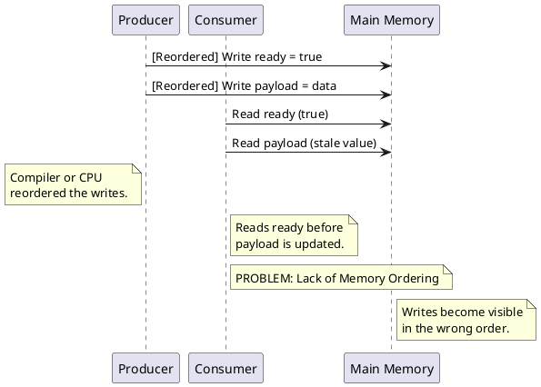

## **Cache Coherence and  Memory Ordering: Ensuring Data Consistency and Correct Execution in Multi-Core Systems**

Modern multi-core processors rely on private caches to reduce latency and improve performance. However, when multiple cores access the same memory location, ensuring consistency across caches *and* the correct order of memory operations becomes essential. **Cache coherence** guarantees that all cores observe a consistent view of memory, preventing stale or incorrect data from affecting computations. **Memory ordering** defines the rules by which memory accesses (reads and writes) appear to occur, both to the core performing the operations and to other cores in the system.

This article explores why cache coherence and memory ordering are crucial, common problems that arise without them, and how protocols and programming techniques address these issues.

### **Why Are Cache Coherence and Memory Ordering Important?**

Cache coherence and memory ordering are fundamental to writing correct and efficient multi-threaded programs. Without them, programs can exhibit unpredictable behavior due to inconsistencies in the data seen by different cores and unexpected orderings of memory operations. This can lead to stale reads, lost updates, synchronization failures, and data corruption.

### **Common Problems in Multi-Core Systems Without Cache Coherence and/or Memory Ordering Guarantees**

It's crucial to understand that some issues are primarily related to cache coherence, some to memory ordering, and some are exacerbated by the lack of both.

#### 1. Stale Reads (Reader-Writer Inconsistency)

*   **Problem:** One core writes a value to memory, while another core reads the same memory location but sees an old (stale) value because there is no mechanism to ensure the second core's cache is updated with the new value. This is primarily a cache coherence issue.
*   **Example:** A flag-based synchronization where the reader sees the flag but not the updated data.
    *   Core 1 writes `flag = true` but the change is only in its private cache.
    *   Core 2 checks `flag`, but it still sees the old value (`false`) and proceeds incorrectly.

#### 2. Memory Ordering Issues (Reordering in Producer-Consumer Patterns)

*   **Problem:** A producer writes data and then sets a flag, but the consumer sees the flag before the data update propagates, not necessarily due to cache staleness, but due to the *order* in which the writes become visible.
*   **Root Cause:** Compiler and CPU optimizations can reorder memory operations.
*   **Example:** A message queue where `msg.ready` is observed before `msg.payload` is updated.



#### 3. Broken Mutual Exclusion (Locks and Mutexes Failing)

*   **Problem:** A core attempts to acquire a lock, but another core still sees an outdated cached copy of the lock variable, causing multiple threads to enter a critical section. This is a combination of both coherence and ordering issues. Stale data prevents proper lock acquisition, and reordering might lead to a release operation being observed before the protected operations complete.
*   **Example:** A spinlock where both threads see `lock = false` due to a stale cache value or reordered operations.

#### 4. Shared Data Structure Corruption (Linked Lists, Trees, Buffers)

*   **Problem:** One core modifies a pointer-based data structure while another core reads it, leading to segmentation faults or undefined behavior. This is often a combination of coherence and ordering issues.
*   **Example:** A linked list where a node is deleted, but another thread still has an outdated pointer.
    *   Core 1 removes a node from the list and updates a pointer.
    *   Core 2, due to stale data or reordered operations, still follows the old pointer.

#### 5. Data Races

*   **Problem:** Data races occur when multiple cores access the same memory location concurrently, and at least one of them is writing, without any synchronization mechanism. This leads to unpredictable and potentially disastrous behavior. This is a fundamental issue that is made worse by the lack of coherence and ordering guarantees.
*   **How Cache Coherence and Memory Ordering Help (But Aren't Enough):** Cache coherence ensures that writes eventually become visible, but doesn't prevent concurrent accesses. Memory ordering can serialize some accesses, but fundamentally, data races *require* proper synchronization using locks, atomics, or other mechanisms.

#### 6. Lost Updates

* **Problem:** Occurs when two or more cores read a value, modify it based on the read value, and then write it back. Without proper synchronization, the write from one core can overwrite the writes from other cores, leading to data loss.

### **Cache Coherence and Performance**

Cache coherence protocols not only ensure correctness but also play a crucial role in maintaining system performance by reducing memory access latency and bus contention.

#### 1. Avoiding Frequent Cache Misses

*   **Without Cache Coherence:** Every read by a core might result in a costly memory access *from main memory*.
*   **With Cache Coherence:** Ensures cores can access recent updates efficiently, often from other cores' caches instead of main memory.
*   **Performance Benefit:** Reduces latency due to fewer accesses to main memory.

   ```plantuml
   @startuml
   participant Core1
   participant Core2
   participant Cache1
   participant Cache2
   participant MainMemory

   Core1 -> Cache1 : Read Data (Miss)
   Cache1 -> MainMemory : Fetch Data
   MainMemory -> Cache1 : Data
   Cache1 -> Core1 : Data

   Core1 -> Cache1 : Write Data
   Core1 -> Cache1 : Acknowledge

   Core2 -> Cache2 : Read Data (Miss)
   Cache2 -> Cache1: Request Data
   Cache1 -> Cache2 : Data (Cache-to-Cache)
   Cache2 -> Core2 : Data

   note right of Core2: With Coherence,\nCore2 fetches data from Cache1,\navoiding MainMemory.
   @enduml
   ```

#### 2. Preventing Unnecessary Cache Invalidations

*   **Without Optimization:** Naïve invalidation policies may cause frequent invalidations, forcing cores to reload data from memory unnecessarily.
*   **With Optimized Cache Coherence:** Modern protocols (e.g., MESI) use state-based tracking to only invalidate lines when absolutely necessary.
*   **Performance Benefit:** Avoids excessive cache flushing, leading to better cache retention and reuse.

   ```plantuml
   @startuml
   participant Core1
   participant Core2
   participant Cache1
   participant Cache2

   Core1 -> Cache1 : Write Data
   Core1 -> Cache2 : Invalidate Cache Line (Excessive Invalidation)

   note right of Core2: Without Optimized Invalidation,\nCache Line is unnecessarily invalidated

   Core1 -> Cache1 : Write Data
   Core1 -> Cache2 : No Invalidation (MESI)
   note right of Core2: With Optimized Invalidation,\nCache line is only invalidated if necessary
   @enduml
   ```

#### 3. Reducing Bus Contention in Shared-Memory Systems

*   **Without Cache Coherence:** Multiple cores repeatedly fetch the same shared data from memory, increasing bus traffic.
*   **With Cache Coherence:** A modified cache line can be shared between cores without frequent memory access.
*   **Performance Benefit:** Reduces memory bus congestion and improves overall execution speed.

#### 4. Optimized Synchronization Performance

*   **Without Cache Coherence or Strict Memory Ordering:** Locks and atomic operations require costly memory barriers and potentially frequent memory access.
*   **With Cache Coherence and Memory Ordering:** Caches maintain coherence efficiently, and memory ordering guarantees minimize the overhead of synchronization primitives.
*   **Performance Benefit:** Faster lock acquisition and release, improving multi-threaded application performance.

### **Memory Models and Memory Ordering**

A **memory model** defines the rules by which memory operations are observed by different cores in a multi-processor system. Different architectures provide different memory models, which offer varying degrees of ordering guarantees. Some common models include:

*   **Sequential Consistency (SC):** The simplest model, where memory operations appear to execute in a total order, and the operations of each core appear in that order. This is the most intuitive but often the most expensive to implement.
*   **Relaxed Consistency Models:** These models relax some of the ordering requirements of sequential consistency to allow for more aggressive optimizations. Examples include total store ordering (TSO), partial store ordering (PSO), and release consistency (RC). These require careful use of memory barriers to ensure correct synchronization.

### **Achieving Correctness: Memory Barriers and Synchronization Primitives**

*   **Memory Barriers (Fences):** Instructions that enforce ordering constraints on memory operations. They tell the compiler and the CPU not to reorder memory accesses across the barrier. Different types of barriers (e.g., acquire, release, full fence) provide different levels of ordering guarantees.
*   **Synchronization Primitives:** Higher-level abstractions that provide synchronization, such as locks, mutexes, semaphores, and atomic operations. These primitives often internally use memory barriers to ensure correct memory ordering.

### **Example: Ensuring Correct Locking with Cache Coherence and Memory Barriers**

```cpp
#include <atomic>
#include <thread>
#include <iostream>

std::atomic<int> lock(0); // Atomic integer to represent the lock

void critical_section(int id) {
    // Try to acquire the lock; spin until successful
    while (lock.exchange(1, std::memory_order_acquire) == 1) {
        // The exchange operation atomically sets the lock to 1 and returns the old value.
        // memory_order_acquire: Ensures that all prior writes from other threads become visible before proceeding.
    }

    // Critical section
    std::cout << "Thread " << id << " entered critical section\n";

    // Release the lock
    lock.store(0, std::memory_order_release); // Set the lock to 0 to release it.
    // memory_order_release: Ensures that all writes before releasing the lock are visible to other threads.
}

int main() {
    std::thread t1(critical_section, 1); // Create thread 1
    std::thread t2(critical_section, 2); // Create thread 2

    t1.join(); // Wait for thread 1 to finish
    t2.join(); // Wait for thread 2 to finish

    return 0;
}

// To compile: g++ -std=c++11 -pthread your_file_name.cpp -o executable_name
```

This demonstrates how cache coherence *and* memory barriers ensure that all threads correctly see updates to the `lock` variable, preventing simultaneous access to the critical section.

*   **Memory Barriers:** Prevent reordering of memory operations related to lock acquisition and release.
*   **Cache Coherence:** Ensures that updates to the `lock` variable are visible to all cores.

#### **Role of Memory Barriers vs. Cache Coherence in the Example**

1.  **Memory Barriers (Acquire-Release Semantics)**

    *   `memory_order_acquire` ensures that all prior writes from other threads become visible before proceeding.
    *   `memory_order_release` ensures that all writes before releasing the lock are visible to other threads before the lock is set to 0.
    *   This prevents instruction reordering and ensures correct synchronization.

2.  **Cache Coherence Protocols (e.g., MESI)**

    *   Even with memory barriers, cache coherence is required to ensure that updates to `lock` in **one core’s cache** are visible to other cores **without explicit memory flushes**.
    *   If there were **no cache coherence**, Core 1 could write `lock = 1`, but Core 2 might still see `lock = 0` due to an outdated cache line.
    *   **With cache coherence,** when Core 1 updates `lock = 1`, the protocol ensures Core 2 gets the updated value (by invalidating the stale copy or updating it directly).

#### **What If There Was No Cache Coherence or Inconsistent Memory Ordering?**

*   Core 1 writes `lock = 1`, but Core 2 might still have a stale cached value (`lock = 0`), *and* the CPU or compiler might reorder operations.
*   This could lead to **two threads entering the critical section simultaneously**, breaking mutual exclusion.
*   Memory barriers and cache coherence are required to provide data consistency and ordering .

#### **Memory Barriers vs. Cache Coherence**

*   **Memory barriers ensure ordering** of operations and prevent reordering.
*   **Cache coherence ensures visibility** of updates across cores **without explicit memory flushes**.
*   **Together,** they ensure correctness and improve performance by avoiding unnecessary memory operations.

### **Types of Cache Coherence Protocols**

There are two primary types of cache coherence protocols:

*   **Snooping Protocols:** Cores monitor (snoop) the bus or interconnect to observe memory transactions made by other cores. Common protocols include MESI (Modified, Exclusive, Shared, Invalid) and its variants. These are typically used in shared-bus or shared-memory systems.
*   **Directory-Based Protocols:** A central directory maintains information about which caches have copies of which memory blocks. This is generally used in larger systems with more cores and distributed memory.

### **Conclusion**

Cache coherence and memory ordering are fundamental concepts in multi-core systems, ensuring memory consistency, preventing stale reads, ensuring correct ordering of operations, and optimizing synchronization mechanisms. By maintaining a coherent view of memory and guaranteeing the proper order of operations across cores, cache coherence protocols and memory barriers significantly enhance performance, correctness, and reliability in modern parallel computing environments. Modern protocols like MESI (a snooping protocol) and directory-based systems, combined with careful use of memory barriers, are key to making multicore systems efficient and reliable.
```

Key changes in this updated version:

*   **Title and Introduction:** Explicitly mention memory ordering.
*   **"Why Are Cache Coherence and Memory Ordering Important?" Section:** Clarifies the combined importance.
*   **Revised "Common Problems" Section:**
    *   Reorganized to emphasize the distinction between problems primarily related to cache coherence, memory ordering, or a combination of both.
    *   Reworded explanations to be more precise.
    *   The Reordering in Producer-Consumer Patterns section is revised and diagram is updated to focus on memory ordering.
*   **Added "Memory Models and Memory Ordering" Section:** Introduces the concept of memory models (SC, relaxed consistency) and memory ordering.
*   **Revised "Example" Section:** Explicitly states that both cache coherence *and* memory barriers are required.
*   **Updated Conclusion:** Emphasizes the combined importance of cache coherence and memory ordering.

This revised article should give a more complete and nuanced understanding of the memory-related challenges in multi-core programming.
